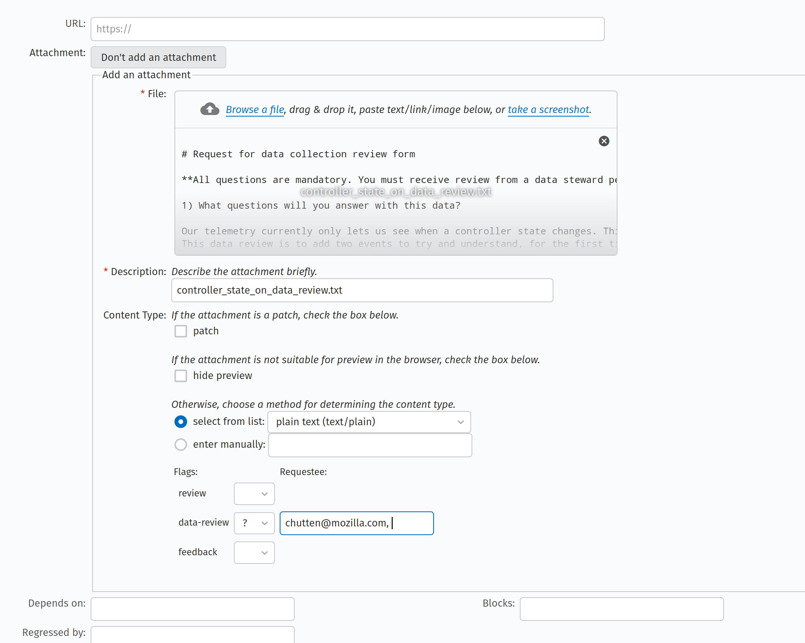

# Mozilla VPN

>_One tap to privacy
Surf, stream, game, and get work done while maintaining your privacy online.
Whether you’re traveling, using public WiFi, or simply looking for more online
security, we will always put your privacy first._

See: https://vpn.mozilla.org

## Getting Involved

We encourage you to participate in this open source project. We love Pull
Requests, Bug Reports, ideas, (security) code reviews, or any other kind of
positive contribution.

Before you attempt to make a contribution please read the [Community
Participation
Guidelines](https://www.mozilla.org/en-US/about/governance/policies/participation/).

Here are some useful links to start:

* [View open
  issues](https://github.com/mozilla-mobile/mozilla-vpn-client/issues)
* [View open pull
  requests](https://github.com/mozilla-mobile/mozilla-vpn-client/pulls)
* [File an
   issue](https://github.com/mozilla-mobile/mozilla-vpn-client/issues/new/choose)
* [File a security
  issue](https://bugzilla.mozilla.org/enter_bug.cgi?product=Mozilla%20VPN)
* Join the [matrix
  channel](https://chat.mozilla.org/#/room/#mozilla-vpn:mozilla.org)
* [View the wiki](https://github.com/mozilla-mobile/mozilla-vpn-client/wiki)
* [View the support
  docs](https://support.mozilla.org/en-US/products/firefox-private-network-vpn)
* Localization happens on
  [Pontoon](https://pontoon.mozilla.org/projects/mozilla-vpn-client/).

If you want to submit a pull-request, please, install the clang format
pre-commit hook: `./scripts/git-pre-commit-format install`

## Checking out the source code

```bash
git clone https://github.com/mozilla-mobile/mozilla-vpn-client.git
cd mozilla-vpn-client
git submodule update --init
```

## How to build from the source code

In order to build this application, you need to install a few dependencies.

#### Install Qt6

Qt6 can be installed in a number of ways:

- download a binary package or the installer from the official QT website:
  https://www.qt.io/download - this is the recommended way for Android and iOS
  builds.
- use a package manager. For instance, we use
  [aqt](https://github.com/miurahr/aqtinstall) for WASM builds.
- compile Qt6 (dynamically or statically). If you want to choose this path, you
  can use our bash script for macOS and Linux:
```bash
./scripts/utils/qt6_compile.sh </qt6/source/code/path> </destination/path>
```
   ... or our batch script for windows:
```bash
./scripts/Qt5_static_compile.bat
```

#### Install Python 3

[Python](https://www.python.org/) >= 3.6 is required. You also need to install
a few python modules using [pip](https://pypi.org/):

```bash
pip install -r requirements.txt --user
```

#### Install rust

[Rust](https://www.rust-lang.org/) is required for desktop builds (MacOS, Linux
and Windows). See the official rust documentation to know how to install it.

#### What's next?

We support the following platforms: Linux, Windows, MacOS, iOS, Android and
WASM. Each one is unique and it has a different section in this document.

### How to build from source code for Desktop

On deskop platforms, such as Windows, Linux and MacOS, we build the Mozilla VPN
using CMake, and as long as the required dependencies can be located in your
PATH the build process is effectively the same on each of the supported platform.

1. Start by creating a build directory and using `cmake` to generate the Makefiles.

```bash
mkdir build && cmake -S . -B build
```

This generation step can be augmented by providing variable definitions on the
command line to adjust features, or help CMake locate its dependencies. The
following variables may be of use:

- `CMAKE_PREFIX_PATH=<Qt install path>/lib/cmake`: can be set if CMake is unable
   to locate a viable Qt installation in your `PATH`.
- `CMAKE_BUILD_TYPE=Release`: can be set to generate a release build, otherwise a
  Debug build is generated by default.
- `BUILD_TESTING=ON`: can be set to build, and execute the unit tests using `CTest`
- `BUILD_ID=<string>`: sets the build identifier that will be embedded into the project. If
  left unset, this will generate a timestamp when configuring the Makefiles.

2. Once the makefiles have been generated, the next step is to compile the source code:
```bash
cmake --build build
```

The following sections go into further detail for each of the supported platforms.

### How to build from source code for Linux

We have tested Mozilla VPN on Ubuntu, Fedora, and Arch Linux but in this
document, we focus on Ubuntu only.

1. On Ubuntu, the compilation of MozillaVPN is relatively easy. In addition to
what we wrote before, you also need the following dependencies:

- libpolkit-gobject-1-dev >= 0.105
- wireguard >= 1.0.20200513
- wireguard-tools >= 1.0.20200513
- resolvconf >= 1.82
- golang >= 1.13
- cmake >= 3.16

2. **Optional**: In case you want to change the shaders, you must regenerate
them:
```bash
./scripts/utils/bake_shaders.sh
```

3. Create a build directory, and configure the project for building using `cmake`.
```bash
mkdir build && cmake -S . -B build
```

If you are using a build of Qt that was not installed by your operating system,
you may need to tell `cmake` where it is located by specifying the `CMAKE_PREFIX_PATH`
during configuration:
```bash
mkdir build && cmake -S . -B build -DCMAKE_PREFIX_PATH=<Qt install path>/lib/cmake/
```

4. Compile the source code:
```bash
cmake --build build -j$(nproc)
```

5. Installation:
```bash
sudo cmake --install build
```

6.  After the installation, you can run the app simply running:
```bash
mozillavpn
```

Alternatively, you can use two terminals to run the daemon manually and
separately e.g.

```bash
sudo mozillavpn linuxdaemon
mozillavpn
```

mozillavpn linuxdaemon needs privileged access and so if you do not run as
root, you will get an authentication prompt every time you try to reconnect the
vpn.

### How to build from source code on MacOS

1. On MacOS, we compile the app using
[XCode](https://developer.apple.com/xcode/) version 12 or higher.

2. You also need to install go >= v1.16. If you don't have it done already,
download go from the [official website](https://golang.org/dl/).

3. Create a build directory, and configure the project for building using `cmake`.
```bash
mkdir build && cmake -S . -B build
```

Some variables that might be useful when configuring the project:
 - `CMAKE_PREFIX_PATH=<Qt install path>/lib/cmake`: can be set if CMake is unable to
   localte a viable Qt installation in your path.
 - `CODE_SIGN_IDENTITY=<Certificate Identity>`: can be set to enable code signing during
   the build process.
 - `INSTALLER_SIGN_IDENTITY=<Certificate Identity>`: can be set to enable signing of the
   installer package.
 - `BUILD_OSX_APP_IDENTIFIER=<App Identifier>`: can be set to change the application bundle
   identifier. This defaults to `org.mozilla.macos.FirefoxVPN` if not set.
 - `BUILD_OSX_DEVELOPMENT_TEAM=<Development Team ID>`: can be set to change the development
   team used for XCode certificates. This defaults to `43AQ936H96` if not set.

4. Compile the source code:
```bash
cmake --build build
```

This will produce the application bundle in `build/src/Mozilla VPN.app`

5.  **Optional**: To build the installer package, we can specify the `pkg` target when
building:
```bash
cmake --build build --target pkg
```

This will produce an unsigned installer package at `build/macos/pkg/MozillaVPN-unsigned.pkg`
and a signed installer at `build/macos/pkg/MozillaVPN-signed.pkg` if a valid installer
signing identity was provided in the `INSTALLER_SIGN_IDENTITIY` variable at configuration
time.

#### Building with XCode

In some circumstances, you may wish to use XCode to build the Mozilla VPN in order to
access cloud-managed signing certificates. In such circumstances, this can be enabled
by using the `-GXcode` command line option:

```bash
mkdir build && cmake -S . -B build -GXcode
```

This will generate an XCode project file at `build/Mozilla VPN.xcodeproj` which can be opened
by Xcode:

```bash
open build/Mozilla\ VPN.xcodeproj
```

Once XCode has opened the project, building is as simple as selecting the `mozillavpn` target
and starting the build from the `Product->Build For->Testing` menu.

*Note*: some developers have experienced that XCode reports that `go` isn't
available and so you can't build the app and dependencies in XCode.  In this
case, a workaround is to symlink `go` into XCode directory as follows:

* Make sure go is 1.16+: `go version`
* Find the location of go binary `which go` example output `/usr/local/go/bin/go`
* Symlink e.g.
```bash
sudo ln -s /usr/local/go/bin/go /Applications/Xcode.app/Contents/Developer/usr/bin/go
```

This step needs to be executed each time XCode updates.

### How to build from source code for iOS

1. On iOS, we compile the app using
[XCode](https://developer.apple.com/xcode/) version 12 or higher.

2. We use `qmake` to generate the XCode project and then we "patch" it to add
extra components such as the wireguard, the browser bridge and so on. We patch
the XCode project using [xcodeproj](https://github.com/CocoaPods/Xcodeproj). To
install it:
```
gem install xcodeproj # probably you want to run this command wityh `sudo`
```

3. You also need to install go >= v1.16. If you don't have it done already,
download go from the [official website](https://golang.org/dl/).

4. Copy `xcode.config.template` to `xcode.config`
```bash
cp xcode.config.template xcode.config
```

5. Modify the xcode.config to something like:
```
# MacOS configuration
APP_ID_MACOS = org.mozilla.macos.FirefoxVPN
LOGIN_ID_MACOS = org.mozilla.macos.FirefoxVPN.login-item

# IOS configuration
GROUP_ID_IOS = group.org.mozilla.ios.Guardian
APP_ID_IOS = org.mozilla.ios.FirefoxVPN
NETEXT_ID_IOS = org.mozilla.ios.FirefoxVPN.network-extension
```

6. Generate the XCode project using our script (and an optional adjust token):
```bash
./scripts/macos/apple_compile.sh ios [--adjust <adjust_token>]
```

7. Xcode should automatically open. You can then run/test/archive/ship the app.
If you prefer to compile the appa in command-line mode, use the following
command:
```bash
xcodebuild build CODE_SIGN_IDENTITY="" CODE_SIGNING_REQUIRED=NO -project "Mozilla VPN.xcodeproj" 
```

### How to build from source code for Android

1. You need to install go >= v1.16. If you don't have it done already, download
go from the [official website](https://golang.org/dl/).

2. Follow the [Getting
started](https://doc.qt.io/qt-6/android-getting-started.html) page.

3. Build the apk
```bash
./scripts/android/package.sh </path/to/Qt6/> <debug|release>
```
Add the Adjust SDK token with `-a | --adjust <adjust_token>`

4. The apk will be located in
`.tmp/src/android-build/build/outputs/apk/debug/android-build-debug.apk`

5. Install with adb on device/emulator
```bash
adb install .tmp/src/android-build/build/outputs/apk/debug/android-build-debug.apk
```

### How to build from source code for Windows

1. For Windows, there are a few extra dependencies to install:

- perl: http://strawberryperl.com/
- nasm: https://www.nasm.us/
- Visual Studio 2019: https://visualstudio.microsoft.com/vs/
- OpenSSL: https://www.openssl.org/source/
- Go: https://golang.org/dl/

We strongly recommend using CMake version 3.21 or later when building with Visual
Studio. Earlier versions of CMake have bugs that can cause the build to hang.

2. Create a build directory, and configure the project for building using `cmake`.
```bash
mkdir build && cmake -S . -B build
```

3. Compile the source code.
```bash
cmake --build build --config Release
```

4.  **Optional**: To build the MSI installer package, we can specify the `msi` target
when building:
```bash
cmake --build build --config Release --target msi
```

### How to build from source code for WASM

Mozilla VPN can be used as a WASM module to test the UI, the localization and
to simulate issues. Take a look at our WASM build
[here](https://mozilla-mobile.github.io/mozilla-vpn-client/).

To build the app as a WASM module, you must install
[emscripten](https://emscripten.org/) and Qt6 for wasm.

Read the following pages to know more:
- https://emscripten.org/docs/getting_started/index.html
- https://doc.qt.io/qt-6/wasm.html

When you are ready, use this script to generate the build:
```bash
scripts/wasm/compile.sh
```

## Testing

* Run the unit tests with `./scripts/tests/unit_tests.sh`
* Run the qml tests with `./scripts/tests/qml_tests.sh`
* Run the lottie tests with `./scripts/tests/lottie_tests.sh`
* Run the funcional tests (See below)

### Running the functional tests

* Install node (if needed) and then `npm install` to install the testing
  dependencies
* Install geckodriver and ensure it's on your path.
  [Docs](https://www.selenium.dev/documentation/getting_started/installing_browser_drivers/)
* Make a .env file with:
 * `MVPN_API_BASE_URL` (where proxy runs, most likely http://localhost:5000)
 * `MVPN_BIN` (location of compiled mvpn binary)
 * `ARTIFACT_DIR` (directory to put screenshots from test failures)
* (Optional) In one window run `./tests/proxy/wsgi.py --mock-devices`
* Run a test from the root of the project: `./scripts/tests/functional_tests.sh {test_file}.js`. To run, say, the authentication tests: `./scripts/tests/functional_tests.sh
  tests/functional/testAuthentication.js`.

## Developer Options and staging environment

To enable the staging environment, open the `Get Help` window, and click on the
`Get Help` text 6 times within 10 seconds to unlock the Developer Options menu.
On this menu, you can enable on the `Staging Server` checkbox to switch to the
staging environment. A full restart of the VPN will be required for this option
to take effect.

## Inspector

The inspector is a debugging tool available only when the staging environment
is activated. When running MozillaVPN, go to the [inspector page](
https://mozilla-mobile.github.io/mozilla-vpn-client/inspector/) to interact
with the app. Connect the inspector to the app using the web-socket interface.
On desktop, use `ws://localhost:8765`.

From the inspector, type `help` to see the list of available commands.

## Glean

[Glean](https://docs.telemetry.mozilla.org/concepts/glean/glean.html) is a
Mozilla new product analytics & telemetry solution that provides a consistent
experience and behavior across all of Mozilla products.

When the client is built in debug mode, pings will have the applicationId
`MozillaVPN-debug`. Additionally, ping contents will be logged to the client
logs and will also be sent to the
[glean debug
viewer](https://debug-ping-preview.firebaseapp.com/pings/MozillaVPN) (login
required) where they are retained for 3 weeks.

More info on debug view in [glean
docs](https://mozilla.github.io/glean/book/user/debugging/index.html).

When the client is in staging mode, but not debug mode, pings will have the
applicationId `MozillaVPN-staging` which allows for filtering between staging
and production pings.

### A note on glean embedding

Qt only accepts `major.minor` versions for importing. So if, for example,
you're embedding glean v0.21.2 then it will still, for Qt's purpose, be v0.21.

### Working on tickets with new glean events

If you are responsible for a piece of work that adds new glean events you will need to do a data review for the new events. This is the recommended process along with some pointers on doing that.

The basic process is this:
* work on your PR that adds glean events including updating glean/metrics.yaml (necessary for your code to compile)
* in your metrics.yaml:
  * include a link to the *github* bug that describes the work
  * put TBD in the `data_reviews` entry
  * think about whether the data you are collecting is technical or interaction, sometimes it's both. in that case pick interaction which is a higher category of data. (more details https://wiki.mozilla.org/Data_Collection)
* open a **draft** PR on github
* file a bugzilla ticket for the data review (more info below)
* update your PR with the id of the bugzilla bug in data `data_reviews` entry
* once you have an r+ from data review, move your PR out of draft state.

It is **ok** for a reviewer to review and approve your code while you're waiting for data review.

It is **not** ok to merge a PR that contains a change to metrics.yaml without a datareview r+

#### Filing a bugzilla ticket for data review

The data review process is described here: https://wiki.mozilla.org/Data_Collection

In brief, specifically for VPN:

* You need a bugzilla account. This is not an ldap service, but do use your ldap email address to sign-up for an account.
* Make a new bug in Product: Mozilla, Component: General. Or clone an old data review bug e.g. https://bugzilla.mozilla.org/show_bug.cgi?id=1770530
* See the above bug, the ticket can be simple just a link to a bug and a PR and the attachment with the data review details (see below).
* The trick to flagging this for data review is adding the attachment and setting the flag (data review ?), as described under "Step 1: Submit Request" on https://wiki.mozilla.org/Data_Collection
* We usually use `chutten` for VPN data reviews
* If you cannot see the flags in the attachment area (screenshot below) make sure "Show Advanced Fields" is checked



Filling out the data review details:

* The data review questionnaire is here: https://github.com/mozilla/data-review/blob/main/request.md
* It can seem quite intimidating, but don't panic. First, look at an old bug such as the one linked above. Many questions will always be the same for VPN data review bugs. There are four questions that require your attention and thought:
  - 1. What questions will you answer with this data?
  - 2. Why does Mozilla need to answer these questions?  Are there benefits for users? Do we need this information to address product or business requirements?
  - 3. What alternative methods did you consider to answer these questions? Why were they not sufficient?
  - 4. Please provide a general description of how you will analyze this data.
* If you don't know the answers to these questions, reach out to Sarah Bird or the product manager so you can answer these with full confidence.


## Status

[](https://github.com/mozilla-mobile/mozilla-vpn-client/actions/workflows/test_unit.yaml)
[](https://github.com/mozilla-mobile/mozilla-vpn-client/actions/workflows/test_qml.yaml)
[](https://github.com/mozilla-mobile/mozilla-vpn-client/actions/workflows/test_lottie.yaml)
[](https://github.com/mozilla-mobile/mozilla-vpn-client/actions/workflows/linters.yaml)
[](https://github.com/mozilla-mobile/mozilla-vpn-client/actions/workflows/linux.yaml)
[](https://github.com/mozilla-mobile/mozilla-vpn-client/actions/workflows/macos-build.yaml)
[](https://github.com/mozilla-mobile/mozilla-vpn-client/actions/workflows/wasm.yaml)
[](https://github.com/mozilla-mobile/mozilla-vpn-client/actions/workflows/windows-build.yaml)
[](https://github.com/mozilla-mobile/mozilla-vpn-client/actions/workflows/ios-build.yaml)
