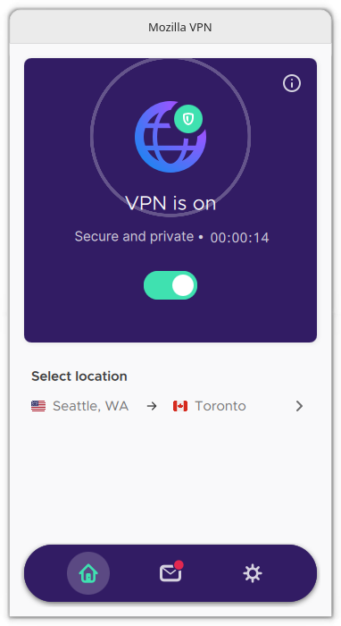
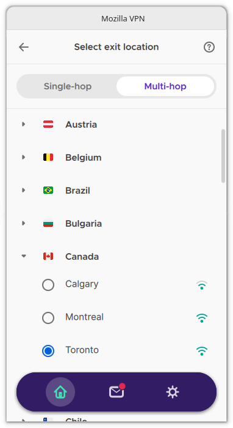

# Mozilla VPN

>_One tap to privacy
Surf, stream, game, and get work done while maintaining your privacy online.
Whether you’re traveling, using public WiFi, or simply looking for more online
security, we will always put your privacy first._

See: https://vpn.mozilla.org

 

## Installing

- [Linux](INSTALLING.md#linux)
    - [Flatpak](INSTALLING.md#flatpak)
    - [Debian & Ubuntu (.deb)](INSTALLING.md#debian--ubuntu-deb)
    - [Fedora (.rpm)](INSTALLING.md#fedora-rpm)
    - [From Source](INSTALLING.md#from-source)
- [Android](INSTALLING.md#android)
    - [Google Play](INSTALLING.md#google-play)
    - [Non Google Play devices](INSTALLING.md#non-google-play-devices)
    - [From Source](INSTALLING.md#from-source-1)
- [Windows](INSTALLING.md#windows)
    - [Windows 10&11 x64](INSTALLING.md#windows-1011-x64)
    - [Windows 11 aarch64](INSTALLING.md#windows-11-aarch64)
    - [From Source](INSTALLING.md#from-source-2)
- [macOS](INSTALLING.md#macos)
    - [From Source](INSTALLING.md#from-source-3)
- [iOS](INSTALLING.md#ios)
    - [From Source](INSTALLING.md#from-source-4)
- [WASM](INSTALLING.md#wasm)
    - [From Taskcluster artifacts](INSTALLING.md#from-taskcluster-artifacts)
    - [From Source](INSTALLING.md#from-source-5)

## Getting Involved

We encourage you to participate in this open source project. We love Pull
Requests, Bug Reports, ideas, (security) code reviews, or any other kind of
positive contribution.

Before you attempt to make a contribution please read the [Community
Participation
Guidelines](https://www.mozilla.org/en-US/about/governance/policies/participation/).

Here are some useful links to start:

* [View open
  issues](https://github.com/mozilla-mobile/mozilla-vpn-client/issues)
* [View open pull
  requests](https://github.com/mozilla-mobile/mozilla-vpn-client/pulls)
* [File an
   issue](https://github.com/mozilla-mobile/mozilla-vpn-client/issues/new/choose)
* [File a security
  issue](https://bugzilla.mozilla.org/enter_bug.cgi?product=Mozilla%20VPN)
* Join the [matrix
  channel](https://chat.mozilla.org/#/room/#mozilla-vpn:mozilla.org)
* [View the wiki](https://github.com/mozilla-mobile/mozilla-vpn-client/wiki)
* [View the support
  docs](https://support.mozilla.org/en-US/products/firefox-private-network-vpn)
* Localization happens on
  [Pontoon](https://pontoon.mozilla.org/projects/mozilla-vpn-client/).

## Status

