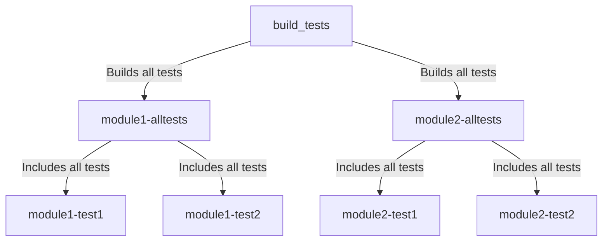

# CMake Project Structure

CMake is the main tool used to generate build configurations for the Mozilla VPN.

> **Note**: The following document, apart from the above sentence, is about where we would like to be, not about where we are right now.
> The modularization of the codebase is currently _ongoing_.

# Modules

The Mozilla VPN codebase is separated into modules and the main application.

Each module is as a CMake target representing a static library. The main application,
on the other hand, is also a CMake target but it represents an executable.

These modules operate as self-contained entities. Upon linking, a module integrates all
necessary dependencies, sources, include directories, compile definitions, and any other essential
components required for its proper functioning.

### Deciding when to create a module

Creating a new module is a appropriate adding new features to the application.

Modules come in handy when these new features need to be accessed by multiple other modules
of the codebase or by both the main application and other modules.

If the new functionality is only needed by one other module and not directly by the main application,
it's usually simpler to just add it to that module instead of creating a whole new one.

### Module structure

Each module has it's own folder under the `src/` directory.

Only source files that are part of the module should be inside it's directory.

Unit test files for the module live under the `tests/` directory of the module.

```
    src/
        mymodule/
            CMakeLists.txt
            modulefile1.cpp
            modulefile1.h
            modulefile2.cpp
            modulefile2.g
            tests/
                test1.cpp
                test1.h
                test2.cpp
                test2.h
```

### Creating the module

Each module is created using the `mz_add_new_module` utility function.

```
mz_add_new_module(
    TARGET_NAME mz_mymodule
    INCLUDE_DIRECTORIES ${CMAKE_CURRENT_SOURCE_DIR}/include
    SOURCES src/file1.cpp src/file2.cpp
    TEST_SOURCES tests/test_file.cpp
    MZ_DEPENDENCIES mz_module
)
```

#### Arguments

- **`TARGET_NAME` (required)**: The name of the CMake target containing this module. All target names should start with the prefix `mz_`.
- **`INCLUDE_DIRECTORIES` (optional)**: List of include directories for this module.
- **`SOURCES`, `<PLATFORM>_SOURCES`, `TEST_SOURCES` (optional)**: List of source files. When prefixed with `<PLATFORM>_` the source file is only included when building for a specific platform. See more about the test sources under "Testing the module".
- **`<TYPE>_DEPENDENCIES` (optional)**: List of CMake targets the module depends on.
    - **`QT_DEPENDENCIES`**: Qt-specific dependencies. The `Qt::` prefix should be skipped from target names added to this list e.g. `Qt::Core`, becomes `Core`.
    - **`MZ_DEPENDENCIES`**: Other modules the current module depends on.
    - **`<PLATFORM>_DEPENDENCIES`**: Platform specific dependencies.
    - **`TEST_DEPENDENCIES`**: Test specific dependencies. If the target name starts with `replace-<dep>`, test executables will replace `<dep>` with it.
    - **`RUST_DEPENDENCIES`**: Rust crates the current module depends on. This expects the path to the directory that contains the crate's `Cargo.toml` file. `mz_add_new_module` will add steps to build and link to this crate automatically.
    - **`EXTRA_DEPENDENCIES`**: Any other dependency that doesn't fit in one of the above types.

### Importing the module on the main project

Upon creating a new module, it's necessary to reference it within the main CMake project.

To achieve this, do `add_subdirectory(<path>/<to>/mymodule)` within the root `src/CMakeLists.txt` file, for example.

Once this step is completed, executing `cmake -S . -B build` will automatically generate build rules for the new module.

Subsequently, the module can be linked to the main project by referencing it appropriately:

```
target_link_libraries(mozillavpn PRIVATE mz_mymodule)
```

Or built by itself:

```
cmake --build build -j${nproc} --target mz_mymodule
```

### Testing the module

Each pair of `.cpp` and `.h` files added to the `TEST_SOURCES` list of a module will become a test executable.

Each test executable can be built by itself. For example:

```
    src/
        mymodule/
            ...
            tests/
                test1.cpp
                test1.h
                test2.cpp
                test2.h
```

`mz_add_new_module` will create a separate CMake target for `test1` and `test2`, which can be built in isolation.

Test targets are named, `<modulename>-<testfilename>`. Therefore in this case, two new targets are created:
`mz_mymodule-test1` and `mz_mymodule-test2`. These can be built by themselves like so:

```
cmake --build build -j${nproc} --target mz_mymodule-test1
cmake --build build -j${nproc} --target mz_mymodule-test2
```

In order to run these executables, we can use CTest or just run them directly:

```
ctest --test-dir build -R mz_mymodule-test1 --output-on-failure --verbose
ctest --test-dir build -R mz_mymodule-test2 --output-on-failure --verbose
```

or

```
build/src/mz_mymodule/tests/mz_mymodule-test1
build/src/mz_mymodule/tests/mz_mymodule-test2
```

For convenience, a CMake target that include all tests under a module is also created:

```
cmake --build build -j${nproc} --target mz_mymodule-alltests
```

Finally, this target is also added as a dependency to the `build_tests` target. So that these tests
are also built when building all tests for the project.


