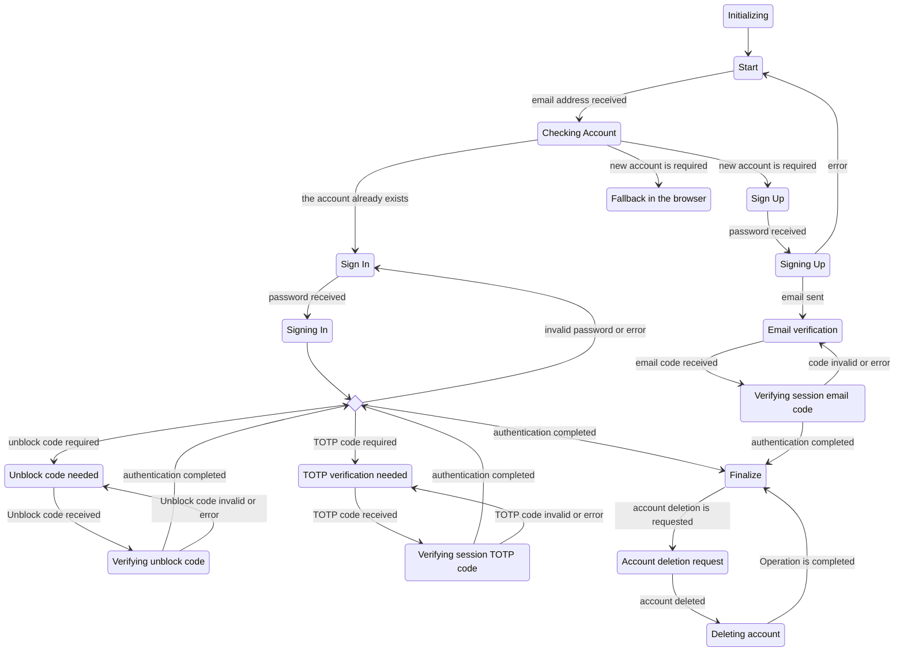

# VPN Authentication in-app

This page describes how the implementation for the authentication in-app works
in the Mozilla VPN client.

To know more about the FxA authentication flow, see the official [FxA API
documentation](https://github.com/mozilla/fxa/blob/main/packages/fxa-auth-server/docs/api.md)

## Authentication methods

The authentication is triggered by the frontend component, calling the method
`VPN.authenticate()`. The client picks the right authentication method based on
what is supported by the current platform. There are mainly 3 methods. The
current configuration for 2.8 is the following:
- Android: in-app authentication with account creation
- iOS: in-app authentication with account creation
- Linux: web-based authentication
- Windows: in-app authentication without account creation
- MacOS: in-app authentication without account creation.

### In-app authentication with account creation

The client allows sign-in and sign-up.

### In-app authentication without account creation

The client allows the sign-in. But if the account doesn’t exist, instead of
starting the account creation in-app, the flow continues in the browser as we
used to do in previous versions.

### Web-based authentication

This flow is what we currently use in v2.7 and previous versions.

## Finite State machine

The authentication flow can be seen and implemented as a [finite state
machine](https://en.wikipedia.org/wiki/Finite-state_machine).
The states are described in the next sections, For each state, we have a list
of error codes to describe what goes wrong. At the end of this document, you
can read the list of all the error codes. On top of these errors, we have the
main ones such as “No internet connection”.

Almost all the states have a call to action (write the email address or the
password, or the 6-digit codes, etc). After this, the frontend code must call
one or more available methods (see the list per states) to move to the next
state or to trigger an error.

### State: Initializing

This is an internal state in which the VPN client communicates with the
guardian-website to start the process. If there are no connectivity issues,
this state takes almost nothing to be completed.
From here, we go to **Start**.

* Next states: **Start**
* Errors: none
* Available methods: none

### State: Start

This state is the starting point for the in-app authentication flow. In this
state, the client asks for the email address. The tasks for this state are:

- Obtain the email address
- Validate the email address
- Process the email address

When the email address is received and validated, the client goes to
**Checking-account** state.

* Next states: **Checking-account**
* Errors:
    * Unknown account - the account does not exist anymore. Super rare.
    * Service unavailable - FxA is down
    * Email can not be used to login - FxA is blocking the account
    * Account already exists - rare
    * Email already exists - rare
    * Email type not supported - ?!?
    * Invalid email address
    * Invalid email code
    * Too many requests
    * Unknown account - ?!?
* Available methods:
    * `MZAuthInApp.checkAccount(emailAddress)`
    * `MZAuthInApp.validateEmailAddress(emailAddress) -> bool`

### State: Checking-account

This state does not require user-interaction. The state machine is completing
the `checkAccount()` operation. This operation can take a few seconds (usually
less).

If the account exists, we go to **Sign-in**, otherwise, for a new account, we
go to **Sign-up** or **fallback in the browser**, in case the authentication
method is “without account creation”.

* Next states: **Sign-in**, **Sign-up**, **fallback in the browser**
* Errors: none
* Available methods: none

### State: Sign-in

The client asks for the password. Then, it goes to the **Signing-in** state.

* Next states: **Signing-in**
* Errors:
    * Incorrect password
    * Too many requests
    * Request Timeout 
    * Sign in with this email type is not currently supported -This is a
      strange FxA code. We have to investigate how to reproduce it.
    * Failed to send email - the unblock code is needed but the email sending
      failed.
* Available methods:
    * `MZAuthInApp.setPassword(password)`
    * `MZAuthInApp.signIn()`

### State: Signing-in

The client interacts with FxA. This should take a few seconds (usually less).
From here we can go to several states:

- **Sign-in**: Something went wrong. Check the error codes.
- **Unblock code needed**: FxA requires an extra validation step. An email is
  sent to the user with a 6-digit code.
- **TOTP verification needed**: the account is configured to use TOTP (double
  factor authentication). The user needs to submit a 6-digit code.
- **Finalize**: the authentication is ready to be finalized

* Next states: **Unblock code needed**, **TOTP verification needed**,
  **Finalize**
* Errors: none
* Available methods: none

### State: Unblock code needed

This state is shown if FxA “doesn’t trust” the account or the user enough. An
email is sent to the user’s email address with a 6-digit code. In this state,
the client needs to inform the user and ask for this 6-digit code.

If needed, the user can ask to have a new email code. See:
`MZAuthInApp.resendUnblockCodeEmail()`.

From here we can go to **Verifying unblock code**.

* Next states: **Verifying unblock code**
* Errors: none
    * Invalid unblock code
    * Too many requests
* Available methods:
    * `MZAuthInApp.verifyUnblockCode(code)`
    * `MZAuthInApp.resendUnblockCodeEmail()`

### State: Verifying unblock code

The client is sending the unblock code to FxA. We are waiting for the result of
the validation. From here, we can go to **Finalize** or back to **Unblock code
needed** in case the code is invalid.

From here we can go to **Finalize**, or **Unblock code needed** in case the code is invalid.

* Next states: **Unblock code needed**, **Finalize**
* Errors: none
* Available methods: none

### State: TOTP verification needed

If the account is configured to use
[TOTP](https://en.wikipedia.org/wiki/Time-based_One-Time_Password), we are in
this state after the **Sign-in**. The client needs to inform the user and asks
for the 6-digit code.  From here, we go to **Verifying session TOTP code**.

* Next states: **Verifying session TOTP code**
* Errors: none
    * Invalid TOTP code
* Available methods:
    * `MZAuthInApp.verifySessionTotpCode(code)`

### State: Verifying session TOTP code

The client is sending the TOTP code to FxA. We are waiting for the result of
the validation.  From here, we can go to **Finalize** or back to **TOTP
verification needed** in case the code is invalid.

* Next states: **TOTP verification needed**, **Finalize**
* Errors: none
* Available methods: none

### State: Sign-Up

In case we need to create a new account, we land in this state. In this state
we need to run a few steps:
- Ask for the password (this is the only thing we really care)
- Ask for other “legal” things (age, terms of service checkbox…)
- Validate the password:
    - The password cannot be a common one (there is a list from FxA)
    - The password must be at least 8 digits
    - The password cannot contain the account email address
- Create the account

From here we go to the **Signing-up** state where the real operation is done.

* Next states: **Signing-up**
* Errors: none
* Available methods:
    * `MZAuthInApp.validatePasswordCommons(password) -> bool`
    * `MZAuthInApp.validatePasswordLength(password) -> bool`
    * `MZAuthInApp.validatePasswordEmail(password) -> bool`
    * `MZAuthInApp.setPassword(password)`
    * `MZAuthInApp.signUp()`

### State: Signing-up

The account creation requires email validation. The user receives a 6-digit
code via email. If this is needed, we go to **Email validation**.
If an error occur, we go back to **Start**.

* Next states: **Start**, **Email validation**
* Errors: none
* Available methods: none

### State: Email validation

This state is super super similar to the “**Unblock code needed**” one, but,
because this is a different FxA concept, we want to keep the 2 separate. The
behavior is exactly the same: the user needs to insert a 6-digit code and then
we go to **Verifying session email code**.

If needed, the user can ask for a new session code email. See
`MZAuthInApp.resendVerificationSessionCodeEmail()`.

* Next states: **Verifying session email code**
* Errors:
    * Invalid or expired verification code
    * Too many requests
* Available methods:
    * `MZAuthInApp.verifySessionEmailCode(code)`
    * `MZAuthInApp.resendVerificationSessionCodeEmail()`

### State: Verifying session email code

The FxA is performing the email code verification. In case of an error, we go
back to **Email validation**, otherwise, we go to **Finalize**.

* Next states: **Email validation**, **Finalize**
* Errors: none
* Available methods: none

### State: Finalize

This is the last state if all works fine. The authentication is ready to be
finalized. This step contains a few network requests to obtain the session
code. After that, the authentication is finally completed.

Implementation-wise, this state does not exist, because, instead of landing
here, we dismiss the authentication component and we show the main VPN view.

If this authentication flow requires the account deletion, the next step is the
**Account Deletion Request**.

* Next states: **Account Deletion Request**
* Errors:
    * Authentication failure
* Available methods: none

### State: Account Deletion Request

If the account deletion is requested, in this state the client asks the user to
accept a few things. Then the account deletion can proceed.

* Next Step: **Deleting account**
* Errors: none
* Available methods:
    * `MZAuthInApp.deleteAccount()`

### State: Deleting account

This is the final step for the account deletion. After that, you can see an
error, or a success.

* Next Step: none
* Errors: none
* Available methods: none

### State: fallback in the browser

In case the authentication method is “without account creation”, we land here.
The authentication continues in the browser as we used to do in v2.7.

* Next states: none
* Errors:
    * Authentication failure
* Available methods: none

## Errors
- Account already exists
- Email already exists
- Email can not be used to login
- Email type not supported
- Failed to send email
- Incorrect password
- Invalid email code
- Invalid or expired verification code
- Invalid unblock code
- Invalid TOTP code
- Too many requests
- Server unavailable
- Request Timeout
- Unknown account

### The whole flow

