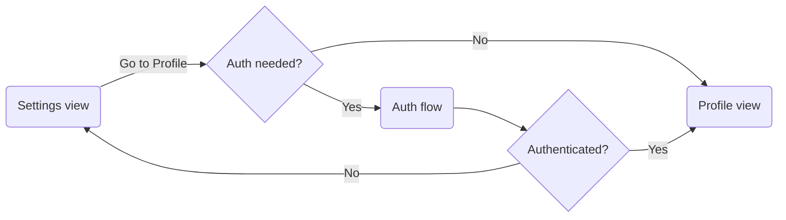

# Subscription management

The “Subscription management” view is shown within the settings “Profile” view. It displays detailed information on the users VPN subscription. If they are authenticated and have all the necessary permissions they are presented with subscription information that is associated with their FxA Account. In case the user has to (re)authenticate they have to go through the [Authentication flow](./authentication-in-app.md).

## Subscription details

The subscription information that is shown to the user.

### Summary list

| Item | Description |
| --- | --- |
| Subscription plan | Amount and interval for billing. |
| Status | Indicates if the subscription is “active” or “inactive”. |
| Next billed | Date on which the next payment will occur. |
| Activated | Date on which the subscription was created. |
| Expires | Expiration date of the subscription. |

### Payment list

| Item | Description |
| --- | --- |
| Payment method | Can be a credit card or an IAP platform. If a credit card is used for payment the last four digits of the credit card number are displayed. |
| Expires | Expiration date of the payment method. Is only shown if a credit card is used for payment. |

### Manage subscription

If the users wishes to actually manage and change data that is related to their subscription they will be directed to the respective subscription platform they subscribed with for the VPN.

## User flow



## Data source

The subscription data is fetched from the Guardian endpoint `/subscriptionDetails`.

### Responses

- `200`: Subscription and billing information returned successfully.
  ```
  {
    "created_at": 1641034800,
    "expires_on": 1643713200,
    "id": "sub_123",
    "is_cancelled": false,
    "payment": {
        "credit_card_brand": "visa",
        "credit_card_exp_month": 12,
        "credit_card_exp_year": 2022,
        "credit_card_last4": "0016",
        "provider": "stripe",
        "type": "credit"
    },
    "plan": {
        "amount": 499,
        "currency": "eur",
        "id": "price_123",
        "interval_count": 1,
        "interval": "month",
        "product_id": "prod_123"
    },
    "plan_id": "price_123",
    "product_id": "prod_123",
    "status": "active",
    "type": "web"
  }
  ```
- `400`: Requested scopes are not allowed.
  ```
  {
    code: 400,
    errno: 163,
    message: "FxA returned requested scopes are not allowed.",
  }
  ```
- `401`: Unauthorized for route.
  ```
  {
      "code": 401,
      "errno": 110,
      "error": "FxA returned unauthorized for route."
  }
  ```

### JSON format

| Property | Description | Type | Required |
| --- | --- | --- | --- |
| id | Subscription expiration date. | String | Yes |
| created_at | Subscription start date. | Number | Yes |
| expires_on | Subscription expiration date. | Number | Yes |
| is_cancelled | Is the subscription cancelled? | Boolean | Yes |
| payment | Payment information associated with the subscription. | Payment Object | Yes |
| plan | Information on the selected subscription plan. | Plan Object | Yes |

### Payment object

Detail info on the payment method.

| Property | Description | Type | Required |
| --- | --- | --- | --- |
| plan_id | ID of the subscription plan. Matches `id` in `Plan`. | String | Yes |
| product_id | ID for the VPN product. | String | Yes |
| provider | Provider that is used for payment. | String | Yes |
| status | Status of the current VPN subscription. | String | Yes |
| type | Type of the payment method. `web`, `iap_google` or `iap_apple` | String | Yes |
| credit_card_brand | Brand of the credit card. Empty if no credit card is used for payment. | String | No |
| credit_card_exp_month | Expiration month of the credit card. Empty if no credit card is used for payment. | Number | No |
| credit_card_exp_year | Expiration year of the credit card. Empty if no credit card is used for payment. | Number | No |
| credit_card_last4 | The last four digits of the credit card number. Empty if no credit card is used for payment. | String | No |

### Plan object

Detail info on the subscription plan.

| Property | Description | Type | Required |
| --- | --- | --- | --- |
| id | ID of the plan. | String | Yes |
| amount | Amount in cents. | Number | Yes |
| currency | Code of the currency the plan is payed in. | String | Yes |
| interval_count | Interval of the selected plan in month. The value can be `1` (monthly), `6` (half-yearly) or `12` (yearly). | Number | Yes |
| product_id | ID for the VPN product. | String | Yes |
