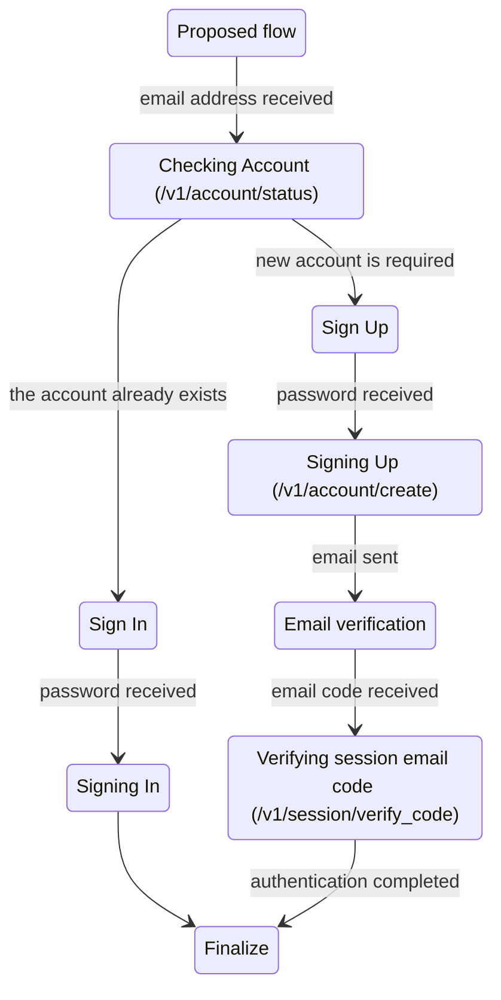

### Current sign-in / sign-up flow (simplified)

```mermaid
stateDiagram-v2
  Start: Current flow
  CheckingAccount: Checking Account (/v1/account/status)
  SignIn: Sign In
  SignUp: Sign Up
  SigningIn: Signing In
  SigningUp: Signing Up (/v1/account/create)
  EmailVerification: Email verification
  VerifyingSessionEmailCode: Verifying session email code (/v1/session/verify_code)
 
  Start --> CheckingAccount: email address received
  CheckingAccount --> SignIn: the account already exists
  CheckingAccount --> SignUp: new account is required
  SignIn --> SigningIn: password received
  SigningIn --> Finalize
  SignUp --> SigningUp: password received
  SigningUp --> EmailVerification: email sent
  EmailVerification --> VerifyingSessionEmailCode: email code received
  VerifyingSessionEmailCode --> Finalize: authentication completed
  Finalize
```

### Proposed sign-in / sign-up flow (simplified)

```mermaid
stateDiagram-v2
  Start: Proposed flow
  CheckingAccount: Checking Account (/v1/account/status)
  SignIn: Sign In
  SignUp: Sign Up
  SigningIn: Signing In
  SigningUp: Signing Up (/v1/account/create)
  EmailVerification: Email verification
  VerifyingSessionEmailCode: Verifying session email code (/v1/session/verify_code)
 
  Start --> CheckingAccount: email address received
  CheckingAccount --> SignIn: the account already exists
  CheckingAccount --> SignUp: new account is required
  SignIn --> SigningIn: password received
  SigningIn --> Finalize
  SignUp --> SigningUp: password received
  SigningUp --> EmailVerification: email sent
  EmailVerification --> VerifyingSessionEmailCode: email code received
  VerifyingSessionEmailCode --> Finalize: authentication completed
  Finalize
```
