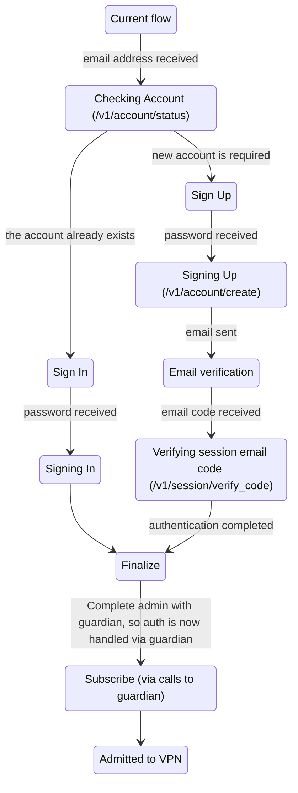
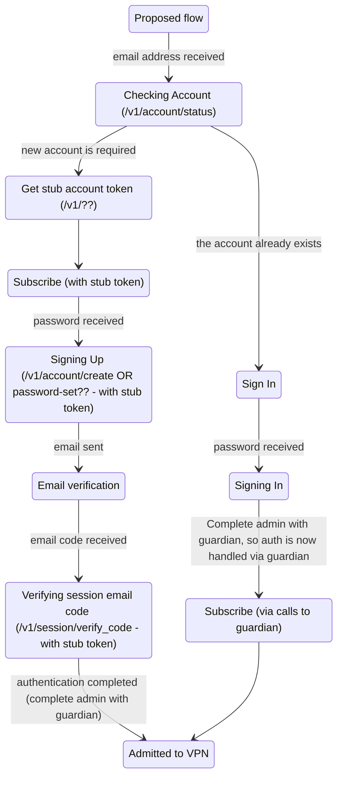

### Current sign-in / sign-up flow (simplified)

```mermaid
stateDiagram-v2
  Start: Current flow
  CheckingAccount: Checking Account (/v1/account/status)
  SignIn: Sign In
  SignUp: Sign Up
  SigningIn: Signing In
  SigningUp: Signing Up (/v1/account/create)
  EmailVerification: Email verification
  VerifyingSessionEmailCode: Verifying session email code (/v1/session/verify_code)
  Finalize: 
  Subscribe: Subscribe (via calls to guardian) 
  Admitted: Admitted to VPN

 
  Start --> CheckingAccount: email address received
  CheckingAccount --> SignIn: the account already exists
  CheckingAccount --> SignUp: new account is required
  SignIn --> SigningIn: password received
  SigningIn --> Finalize
  SignUp --> SigningUp: password received
  SigningUp --> EmailVerification: email sent
  EmailVerification --> VerifyingSessionEmailCode: email code received
  VerifyingSessionEmailCode --> Finalize: authentication completed
  Finalize --> Subscribe: Complete admin with guardian, so auth is now handled via guardian
  Subscribe --> Admitted
```

### Proposed sign-in / sign-up flow (simplified)

Note that no emails should be generated on the FxA side other than the verify code email.

```mermaid
stateDiagram-v2
  Start: Proposed flow
  CheckingAccount: Checking Account (/v1/account/status)
  SignIn: Sign In
  StubAccount: Get stub account token (/v1/??)
  SigningIn: Signing In
  SigningUp: Signing Up (/v1/account/create OR password-set?? - with stub token)
  EmailVerification: Email verification
  VerifyingSessionEmailCode: Verifying session email code (/v1/session/verify_code - with stub token)
  Subscribe: Subscribe (via calls to guardian) 
  SubscribeStub: Subscribe (with stub token)
  Admitted: Admitted to VPN
 
  Start --> CheckingAccount: email address received
  CheckingAccount --> SignIn: the account already exists
  CheckingAccount --> StubAccount: new account is required
  StubAccount --> SubscribeStub
  SubscribeStub --> SigningUp: password received
  SignIn --> SigningIn: password received
  SigningUp --> EmailVerification: email sent
  EmailVerification --> VerifyingSessionEmailCode: email code received
  VerifyingSessionEmailCode --> Admitted: authentication completed (complete admin with guardian)
  SigningIn --> Subscribe: Complete admin with guardian, so auth is now handled via guardian
  Subscribe --> Admitted
```
