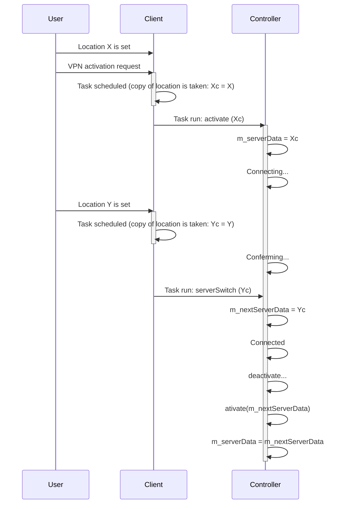

# Controller state machine

In this file we will document how the VPN Controller works. But in the meantime, we just have a diagram about how the ServerData object is cached to avoid race conditions with the rest of the app.

### Activation flow

- m_serverData is a copy of the location, taken when the user (or something else) triggers a VPN activation. This value is kept constant for the whole duration of the operation. If something happens, this and MozillaVPN::serverData are in sync.
- If there is a server-switch request while an activation is in progress, we start a disconnect operation and we store the new location in m_nextServerData.

See this flow:

