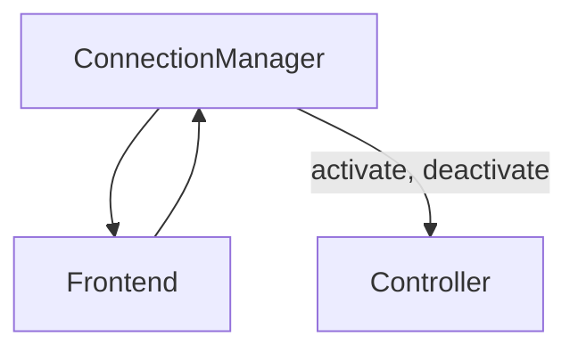

- Status: In review
- Date: 2023-06-20
- Author: [@gela](https://github.com/gela)
- RFC PR: https://github.com/mozilla-mobile/mozilla-vpn-client/pull/7269
- Implementation GitHub issue: TBD.


## Summary
Propose a new `ConnectionManager` component which sits between the frontend and the controller to handle all connectivity related logic and let the controller only handle activation and deactivation.

## Motivation
The current controller code is complicated, lengthy, and bug-prone. Over time we have continued to directly add more logic and checks for various scenarios to the controller code, resulting in a large file that is hard to scale and keep under control. Some of the bugs that have come to life as a result are: [“Server unavailable” modal displayed when connecting to a Captive Portal network while VPN is OFF](https://mozilla-hub.atlassian.net/browse/VPN-4248) and [“Server unavailable” modal displayed if the device is not connected to the internet when the client is launched at startup](https://mozilla-hub.atlassian.net/browse/VPN-3177).

Because our current approach is not scalable, we’ve been facing issues in the connectivity space, especially when it comes down to identifying the root cause. This means the behavior of our client is inconsistent not just on different platforms, but also within the same environment. For example, if a user loses network connectivity while the VPN is activated, sometimes they enter no signal, and other times they encounter the “server location unavailable” modal. This inconsistency is a result of racing checks and error reporting. The goal of this refactor is to combine all of these scenarios under one component and to get rid of the `ConnectionHealth` entirely to resolve this issue.


## Proposed Solution
Move all connectivity code out of the controller and into its separate component which is referred to as the `ConnectionManager` in this document. 

The controller object will continue to remain but its purpose will be drastically simplified to a few basic functionalities including `activate()` and `deactivate()`. We will no longer have any states associated with the Controller and all states will live in the `ConnectionManager`. The `ConnectionManager` will primarily act as a liaison between the controller and the UI. 



The advantage to this approach is that instead of having multiple state machines within the controller and connection health, they will be consolidated in the connection manager which handles all scenarios. Allowing the `ConnectionManager` to be the only point of reference for the connection state simplifies determining the connectivity state in which the VPN is in at any moment.

The existing Connection Health object in VPN performs checks that act in the same space as the `ConnectionManager`. For example, in connection health, we periodically send pings and collect some data upon receiving (or not receiving) a response which allows us to draw conclusions regarding network connectivity and server availability. Because there is so much overlap within both classes, the creation and implementation of the Connection Manager component allows us to entirely get rid of connection health and move any remaining logic to `ConnectionManager`. We should be able to entirely eliminate the `ConnectionHealth` class as well as the states `NoSignal` and `Stable` given that they will be handled within the new Connection Manager logic. For example, currently, we may enter the No Signal state due to several reasons such as losing network connectivity, expired subscription, or server location becoming unavailable, this means that No Signal is simply a side effect of something else going wrong, and because we now have explicit messaging and checks for those, No Signal does not serve us and can be removed.

One exception to the rule is `ConnectionHealth::ConnectionStability::Unstable`. The connection health object periodically sends pings and measures the received responses to assess whether or not the network connectivity is stable. To continue notifying users about their unstable network, we will continue to use this state within `ConnectionManager`. 

Beyond the connectivity checks, the Controller also manages how much time has elapsed since the VPN was toggled on. Having this logic in the controller bloats the code without any gains, so that code will be moved out of `Controller` and instead a simple `Timer` object will encapsulates the related logic. The timer starts when the VPN enters State On since doing the initial checks may take a few seconds that we don't need to account for.

Because this is all part of a unified connectivity experience, we do not want to release bits and pieces of this until everything is implemented, tested, and ready to go, this means that all implementation will live behind a feature flag until we are ready to test and release.


## Implementation Plan
Introduce a new `ConnectionManager` component that is activated when the client is launched and connects to `networkWatcher` in case anything changes. This new component will manage the following work:
- Internet probe: assess if there is a network connection.
- Firewall: assess if firewall is limiting network connectivity.
- Captive portal check: determine uf the network is behind a captive portal.
- Server probe: upon activation and then priodically check if there are available servers within user's selection location.
- Subscription status: ensure that user has an active subscription, and if not, show the "No Subscription Found" screen.

The logic to calculate elapsed time since the VPN was activated will also be moved out of the Controller and into a new `Timer` component. This bit of work will likely require a separate RFC. 


The `ConnectionManager` will have two state machines:
1. `VPNClientState` to determine if the VPN client is off, connecting, or on. 
2. `ConnectionState` to keep track of which connection related task the VPN is performing at any given point. 

Before the VPN is toggled on, it is in `VPNClientStateOff`. When user toggles on the VPN, the client goes into `VPNClientStateConnecting`, the connection manager will perform the needed connection checks such as `ConnectionStateInternetProbe` and `ConnectionStateServerProbe`. If they all succeed, the VPN will enter `VPNClientStateOn` and call `Controller::activate()`.

The `ConnectionManager` will communicate to the `Controller` to `activate()` and `deactivate()` the VPN. During one of the iterations of this proposal, someone asked if we can have signals instead of states in the `ConnectionManager`. The short answer is no. While emitting a signal to notify the UI about what we should be showing the user does the same thing, we still need to keep track of the current state internally so we know what to do next in case anything goes wrong at any other point.

Here is the proposed set of `ConnectionManager` states and how they map to the `Controller` states. Please note that some of these states may go away once we are further along the implementation (e.g. we may not need `ConnectionStateSilentSwitching` anymore):

```c++
  enum VPNClientState {
    VPNClientStateOff,          // VPN is off
    VPNClientStateConnecting,   // VPN is perform connection and 
                                // subscription probes in ConnectionState
    VPNClientStateOn,           // VPN is on
  }

  enum ConnectionState {
    ConnectionStateInternetProbe,      // Corresponds to controller states:
                                       // StateConnecting
    ConnectionStateServerProbe,        // Corresponds to controller states:
                                       // StateConnecting
    ConnectionStateFirewall,           // Corresponds to controller states:
                                       // StateConnecting
    ConnectionStateCaptivePortal,      // Corresponds to controller states:
                                       // StateConnecting
    ConnectionStateCheckSubscription,  // Corresponds to controller states:
                                       // StateCheckSubscription

    // Mirrored from Controller states
    ConnectionStateSilentSwitching,  // Corresponds to StateSilentSwitching
    ConnectionStateSwitching,        // Corresponds to StateSwitching
    ConnectionStateConfirming,       // Corresponds to controller states:
                                     // StateConfirming
    ConnectionStateDisconnecting     // Corresponds to controller state:
                                     // StateDisconnecting
  };
```

If at any point any of the checks in `ConnectionManager::ConnectionStates` fails then we will emit a signal to the frontend explaining what exactly the issue is. For example, if we are in `ConnectionManager::ConnectionStateInternetProbe` and the internet probe fails, we will notify the frontend via `emit connectionStateInternetProbeFailed()` signal. This allows the UI to notify the user that the VPN activation failed due to their network connectivity issue and may offer troubleshooting advice such as checking that their wifi/cellular is enabled. It is worth noting that in any given circumstance, we will not deactivate the VPN on the backend regardless of the failure. 

## Metrics and Measurements

This change also means that prior to the activation of the VPN, there are multiple checks and probes that need to succeed; this will take some time (hopefully no more than a couple of seconds), and as long as we communicate to the user via front end prompts about what is happening, this is acceptable. 

To confidently determine that these checks do not delay the VPN activation by an unacceptable amount, we need to measure the duration of the _time elapsed from toggling on the VPN to activation_. This is the only relevant metric, given that in any other scenario the checks run in the background and would not affect the user experience.

## Task Breakdown

This is a big undertaking that will take multiple sprints to complete. The work will be broken down into multiple tasks listed below:

1. Create a new `ConnectionManager` object with relevant states. Initially, this will have a 1:1 map to the controller so we can debug and ensure the component works as intended. As we add the logic to probe for various scenarios and move further along the implementation work, we can remove them from the `Controller`.
2. Add probe internet to `ConnectionManager`: This will allow us to check if there is an active internet connection.
3. Add firewall probe to `ConnectionManager`: To make sure there are no firewall issues blocking access to the internet.
4. Add captive portal probe to `ConnectionManager`: This will ensure that the user is not stuck behind a captive portal, which can interfere with internet access.
5. Add check subscription to `ConnectionManager`: This will allow us to verify that the user has an active subscription before proceeding.
6. Add server probing to `ConnectionManager`: To ensure that the servers within the user's selected location are available and running.
7. Get rid of the `ConnectionHealth` object
8. Audit and cleanup `Controller::stateChanged`. We need to audit all areas where code is listening to `Controller::stateChanged` and see if it should be monitoring the `ConnectionManager` instead, if that is the case, make the necessary changes. [Here](https://searchfox.org/mozilla-vpn-client/search?q=Controller%3A%3AstateChanged&path=&case=false&regexp=false) is a current list of every instance we should audit.
9. Move timestamp code to its own class/object


## Questions
- None at the moment
