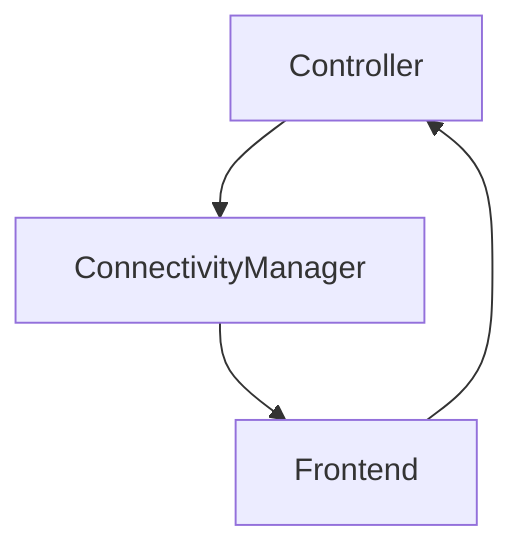

- Status: In review
- Date: 2023-06-20
- Author: [@gela](https://github.com/gela)
- RFC PR: https://github.com/mozilla-mobile/mozilla-vpn-client/pull/7269
- Implementation GitHub issue: TBD.


## Summary
Introduce a new `ConnectivityManager` component which sits between the frontend and controller to handle all connectivity related logic and keep the controller code lean and minimal.

## Motivation
The current controller code is complicated, lengthy and bug-prone. Over time we have continued to directly add more logic and checks for various scenarios to the controller code. 

Because our current approach is not scalable, we’ve been facing numerous issues in the connectivity space, especially when it comes down to identifying exactly what is causing the issue. This means the behavior of our client is extremely inconsistent both in different platforms but also within the same environment. For example if a user loses network connectivity while the VPN is activated, sometimes they enter no signal, and other times they encounter the “server location unavailable” modal. This inconsistency is a result of racing checks and error reporting. The goal of this refactor is to combine all of these scenarios under one component and to get rid of the Connection Health entirely to resolve this issue.


## Proposed Solution
Move all connectivity related code out of the controller and into its own separate component which is referred to as the Connectivity Manager in this document. The controller object will continue to remain but its purpose will be drastically simplified to a few basic functionalities including `activate()` and `deactivate()`. The connectivity manager will primarily act as a liaison between the controller and the UI. 



The existing Connection Health object in VPN performs checks that act in the same space as the connectivity manager. For example in connection health we periodically send pings and collect some data upon receiving (or not receiving) a response which allows us to draw conclusions regarding network connectivity and server availability. Because there is so much overlap in the nature of both classes, the creation and implementation of the Connectivity Manager component allows us to entirely get rid of connection health and move any remaining logic to connectivity manager. We should be able entirely eliminate the `ConnectionHealth` class and its corresponding states (Stable, Unstable, NoSignal). The remainder of logic which sends and receives pings and measures latency and standard deviation can be all moved to the `ConnectivityManager`.

Beyond the connectivity checks, the Controller also manages how much time has elapsed since the VPN was toggled on. Having this logic in controller bloats the code without any gains, so I would like to move that code out of `Controller` and instead introduce a simple `Timer` object that encapsulates the related logic.

Because this is all part of a unified connectivity experience, we do not want to release bits and pieces of this until everything is implemented, test and ready to go, naturally this means that all implementation will live behind a feature flag until we are ready to test and release.


## Implementation Plan
Introduce a new `ConnectivityManager` component that is activated when the client is launched and connects to `networkWatcher` in case anything changes. This new component will manage the following work:
- Internet probe
- Firewall
- Captive portal check
- Server probe
- Subscription status

We will also add a new `Timer` component to keep track of how much time has elapsed since the VPN was activated. 


The `ConnectivityManager` has various connection states to keep track of which connection related task the VPN is performing at any given point. This means that the `ConnectivityManager` will communicate with the `Controller` so that the controller knows which state to enter at every stage. Here is the proposed set of `ConnectivityManager` states and how they map to the `Controller` states:

```c++
  enum ConnectionState {
    ConnectionStateOff,  // Corresponds to controller states: StateInitializing,
                         // StateOff
    ConnectionStateInternetProbe,      // Corresponds to controller states:
                                       // StateConnecting
    ConnectionStateServerProbe,        // Corresponds to controller states:
                                       // StateConnecting
    ConnectionStateFirewall,           // Corresponds to controller states:
                                       // StateConnecting
    ConnectionStateCaptivePortal,      // Corresponds to controller states:
                                       // StateConnecting
    ConnectionStateCheckSubscription,  // Corresponds to controller states:
                                       // StateCheckSubscription
    ConnectionStateOn,  // Corresponds to controller state: StateOn

    // Mirrored from Controller states
    ConnectionStateSilentSwitching,  // Corresponds to StateSilentSwitching
    ConnectionStateSwitching,        // Corresponds to StateSwitching
    ConnectionStateConfirming,       // Corresponds to controller states:
                                     // StateConfirming
    ConnectionStateDisconnecting     // Corresponds to controller state:
                                     // StateDisconnecting
  };
```

If at any point any of the checks in `ConnectivityManager::ConnectionStates` fails then we will emit a signal to the frontend explaining what exactly the issue is. For example if we are in `ConnectivityManager::ConnectionStateInternetProbe` and the internet probe fails, we will notify the frontend via `emit connectionStateInternetProbeFailed()` signal. This allows the UI to notify the user that the VPN activation failed due to their network connectivity issue and can possibly offer troubleshooting advice such as checking that their wifi/cellular is enabled. It is worth noting that in any given circumstance, we will not deactivate the VPN on our end regardless of the failure. 

This is a big undertaking that will take multiple sprints to complete. This document does not quiet cover the extent of work required for creating new unit and functional tests as well as updating the existng ones that will be affected. I propose we break down the work like below:

1. Create a new `ConnectivityManager` object with relevant states. Initially this will have a 1:1 map to the controller so we can debug and ensure the component works as intended. As we add the logic to probe for various scenarios and move further along the implementation work, we can remove them from the `Controller`.
2. Add probe internet to `ConnectivityManager`
3. Add firewall probe to `ConnectivityManager`
4. Add captive portal probe to `ConnectivityManager`
5. Add check subscription to `ConnectivityManager`
6. Add server probing to `ConnectivityManager`
7. Get rid of the `ConnectionHealth` object
8. Audit and cleanup `Controller::stateChanged`. We need to audit all areas where code is listening to `Controller::stateChanged` and see if it should be monitoring the `ConnectivityManager` instead, if that is the case, make the necessary changes. [Here](https://searchfox.org/mozilla-vpn-client/search?q=Controller%3A%3AstateChanged&path=&case=false&regexp=false) is a current list of every instance we should audit.
9. Move timestamp code to its own class/object


### Audit and cleanup `Controller::stateChanged`
Below is a list of all areas where we monitor when the controller state changes. For each usage, I have added a comment proposing if it should be changed to watch `ConnectivityManager::stateChanged` instead. My rule of thumb is that if the code is that if it is UI/Frontend related, it should monitor the `ConnectivityManager`. If it is error handling related, it should continue to monitor the `Controller`. 

- `Commandactivate::run()`: Connectivity Manager
- `Commanddeactivate::run()`: Connectivity Manager
- `CommandStatus::run()`: Connectivity Manager
- `CommandUI::run()` -> line #390 creates and shows notification, should be watching the connectivity manager. Line #401 changes the MacOS menu, should be watching connectivity manager. 
- `ConnectionBenchmark::initialize()`: because it is doing error handling, it should continue monitoring the controller states.
- `IpAddressLookup::initialize()`: Not sure about this.
- `KeyRegenerator::KeyRegenerator()`: Controller I THINK.
- `MozillaVPN::MozillaVPN()`: #167 Not sure.  #170 notifies the UI that a refresh is needed so it should be monitoring connectivity manager. #179 this most likely will be changed since we are also refactoring connection health stuff. #183 deals with captive portal stuff and should be monitoring the Connectivity Manager instead.
- `IOSNetworkWatcher::initialize()`: I think this will continue to monitor the controller
- `ServerConnection::ServerConnection()`: Controller
- `ServerLatency::initialize()`: since for now the server latency code is staying in the controller, this will continue to monitor the controller states.
- `SettingsWatcher::SettingsWatcher()`: Controller
- `SubscriptionMonitor::SubscriptionMonitor()`: connectivity manager since it is the component that handles subscription moving forward.
- `SystemTrayNotificationHandler::initialize()`: updates the context menu, should be watching connectivity manager
- `TaskControllerAction::run()`: Queues connections, so it should continue watching the controller.
- `Telemetry::initialize()`: It relies on the current state of the vpn to stop and start timer, and should be watching the connectivity manager. 


## Questions
- Please review the list of `Controller::stateChanged` audits and let me know if you have a different opinion.
- Do we need a `ConnectionState::Unstable` in `ConnectivityManager` which we would enter if missing a bunch pf ping replies?
- Thoughts on the component name `ConnectivityManager`? Speak now or forever hold your peace.
