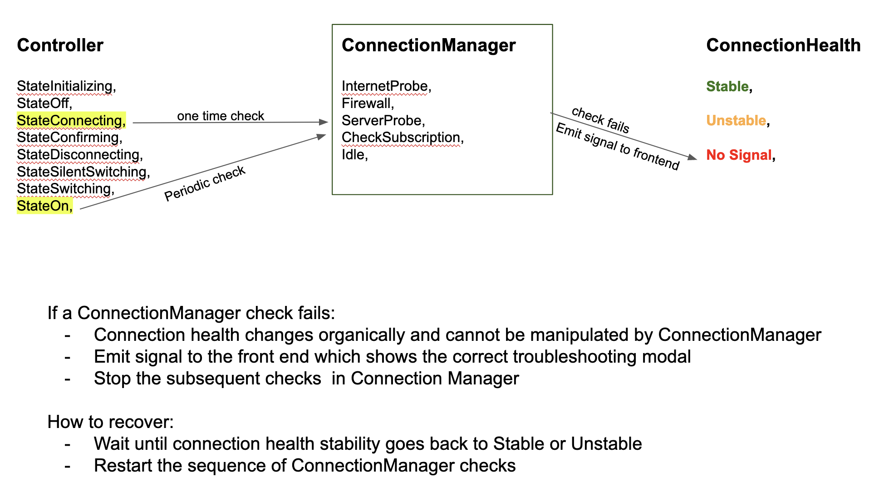

- Status: In progress
- Date: 2023-11-02
- Author: [@gela](https://github.com/gela)
- RFC PR: TBD
- Implementation GitHub issue: TBD.


## Summary

Propose a new `ConnectionManager` component which handles all connectivity related checks once during VPN activation (`Controller::StateConnecting`) and then periodically once the VPN is already activated (`Controller::StateOn`); the controller will continue to exist as is, communicating with the frontend as the backend goes through various states such as `connecting` and `confirming` to reflect those to the user.

## Motivation

At present, the handling of VPN connectivity lacks standardization and consistency. There are instances when the VPN goes into No Signal due to a variety of connectivity-related issues, such as the network connection failing or the server location becoming unavailable. In these situations, users are often left without a clear explanation of what went wrong or guidance on how to troubleshoot and resolve the issue. They may encounter a background error message or lose signal without further information.

The objective with the Connection Manager is to address these issues by running probes on all potential causes and presenting the user with an appropriate modal detailing the root cause of their problem. This approach aims to enhance the user's understanding of the issue and provide them with actionable steps to rectify it.

To avoid further complicating the already complex logic of the controller, this document proposes encapsulating this new functionality within the Connection Manager. This object will interact with both the controller and connection health, serving as a dedicated entity for managing and improving VPN connectivity. This approach ensures a more streamlined and efficient handling of VPN connectivity issues, ultimately enhancing the user experience.

## Proposed Solution

We will introduce a new object, the Connection Manager, which will be responsible for managing all probes. These probes are stored as distinct states within an enumeration class, `ConnectionManager::State`. The Connection Manager will sequentially cycle through each of these states in a systematic order, only proceeding to the next state if the current probe is successful.

In the event of a probe failure, the Connection Manager will emit a signal to the frontend. This will trigger a modal to be displayed to the user, providing an explanation of the issue and suggesting potential solutions. Upon encountering a failed probe, the progression through the remaining probes is immediately halted. Once the issue has been resolved, the cycle of probes commences anew. If there are no ongoing probes, the Connection Manager will enter an Idle state.

The Connection Health, an existing component of our codebase, is tasked with sending periodic pings and determining the stability of the VPN based on the responses received (see `ConnectionHealth::healthCheckup()`). It classifies the VPN stability as `Stable`, `Unstable` (some missing responses), or `NoSignal` (no responses received). When the VPN experiences issues with network connectivity or server availability, it naturally transitions into the No Signal state and, ideally, recovers once the issue is resolved. We can leverage this logic to recover from a probe failure within the Connection Manager.

## Implementation Plan

```c++
enum ConnectionManagerStates {
  InternetProbe,
  Firewall,
  ServerProbe,
  CheckSubscription,
  Idle,
}
```
### Upon VPN Activation (`StateOff` to `StateConnecting`)
Perform a single cycle going through all the Connection Manager probes.
- If a probe fails:
  - Set Controller to `StateOff`
  - Stop subsequent probes from running
  - emit a signal to the frontend communicating which probe failed
- If all probes pass:
  - Activate VPN (Controller `StateOn`)

### VPN is already active (`StateOn`)
Perform periodic checks cycling through all the Connection Manager probes.
- If a probe fails:
  - Controller continues to stay in `StateOn`. We will __never__ toggle the VPN off without the user explicitly doing so themselves
  - We will __not__ manipulate the Connection Health stability based on Connection Manager probes
  - Stop subsequent probes from running
  - emit a signal to the frontend communicating which probe failed
- If all probes pass:
  - Do nothing. VPN stays on and stable

> Note: The second scenario where a check fails when the VPN is already active still needs some more thinking. There will likely be a follow up design doc on how we will approach that later on.

### How to recover after a failed probe
- If VPN is not in `StateOn` yet:
  - Connection Manager will emit signal about the failed probe to notify the frontend
- If VPN is in `StateOn`:  
  - Wait until Connection Health stability goes back to Stable or Unstable
  - Restart the sequence of ConnectionManager checks



## Metrics and Measurements

This change also means that prior to the activation of the VPN, there are multiple checks and probes that need to succeed; this will take some time (hopefully no more than a couple of seconds).

To confidently determine that these checks do not delay the VPN activation by an unacceptable amount TBD, we need to measure the duration of the _time elapsed from toggling on the VPN to activation_. We are interested in the VPN activation duration because it delays the VPN being toggled on. This also allows us to keep track of the duration of each operation which allows us to continually monitor the system health and identify any slow downs and changes.

In addition to measurements pertaining to the duration, we are also interested in quantifying the probe success to failure rate for each scenario.

