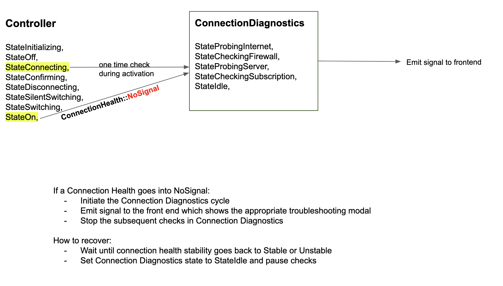

- Status: In progress
- Date: 2023-11-02
- Author: [@gela](https://github.com/gela)
- RFC PR: TBD
- Implementation GitHub issue: TBD.


## Summary

The existing `ConnectionManager` class will be renamed `ConnectionDiagnostics` and will be responsible for handling all connectivity related checks once during VPN activation (`Controller::StateConnecting`) and then periodically once the VPN is already activated (`Controller::StateOn`); the controller will be the entity which manages the controller states the client goes through such as `connecting` and `confirming`.

## Motivation

At present, the handling of VPN connectivity lacks consistency for users. There are instances when the VPN goes into No Signal due to a variety of connectivity-related issues, such as the network connection failing or the server location becoming unavailable. In these situations, users are often left without a clear explanation of what went wrong or guidance on how to troubleshoot and resolve the issue. They may encounter a "background error occurred" banner or lose signal without further information.

The objective with the Connection Diagnostics is to address these issues by running probes on all potential causes and presenting the user with an appropriate modal detailing the root cause of their problem. This approach aims to enhance the user's understanding of the issue and provide them with actionable steps to rectify it.

To avoid further complicating the already complex logic of the controller, this document proposes encapsulating this new functionality within the Connection Diagnostics. This object will interact with both the controller and connection health, serving as a dedicated entity for identifying connection problems and correctly communicating status changes to the UI, ultimately enhancing the user experience.

## Proposed Solution

The Connection Diagnostics will be responsible for managing all probes. These probes are stored as distinct states within an enumeration class, `ConnectionDiagnostics::State`. The Connection Diagnostics will sequentially cycle through each of these states in a systematic order, only proceeding to the next state if the current probe is successful. If all probes pass but VPN stability is still `NoSignal`, then we would not present any modals to the user, but the controller will continue to show "No Signal" as we do currently.

In the event of a probe failure, the Connection Diagnostics will emit a signal. The frontend will listen to that signal and display a modal to the user providing an explanation of the issue and suggesting potential solutions. Upon encountering a failed probe, the progression through the remaining probes is immediately halted and the Connection Diagnostics will enter the Idle state.

The Connection Health, an existing component of our codebase, is tasked with sending periodic pings and determining the stability of the VPN based on the responses received (see `ConnectionHealth::healthCheckup()`). It classifies the VPN stability as `Stable`, `Unstable` (some missing responses), or `NoSignal` (no responses received). When the VPN experiences issues with network connectivity or server availability, it naturally transitions into the No Signal state and eventually recovers once the issue is resolved. We can leverage this logic to recover from a probe failure within the Connection Diagnostics.

> For specific details about how these failures are handled and communicated with the user, please refer to this [Figma document](https://www.figma.com/file/GZKigVZbnCisMJNU3Hc9xM/Connection-error-messaging?type=design&node-id=26-215&mode=design&t=kfYnUKuXQ9nsGDRR-0).

## Implementation Plan

```c++
enum ConnectionDiagnosticsStates {
  StateProbingInternet,
  StateCheckingFirewall,
  StateCheckingCaptivePortal,
  StateProbingServerLocation,
  StateCheckingSubscription,
  StateIdle,
}
```

### Upon VPN Activation (`StateOff` to `StateConnecting`) - Phase 1
Perform a single cycle going through all the Connection Diagnostics probes.
- If a probe fails:
  - Set Controller to `StateOff`
  - Stop subsequent probes from running
  - emit a signal communicating which probe failed
  - VPN will remain in `StateOff`
  - Connection Diagnostics will go into `StateIdle`
- If all probes pass:
  - Activate VPN (Controller `StateOn`)
  - Connection Diagnostics will go into `StateIdle`

### VPN is already active (`StateOn`) - Phase 2
If the VPN is already active and Connection Health stability goes into no signal, initiate a diagnostics cycle to perform a set of checks to identify the underlying cause.

- If a probe fails:
  - Controller remains in `StateOn`. We will __never__ toggle the VPN off without the user explicitly doing so themselves
  - We will __not__ manipulate the Connection Health stability based on Connection Diagnostics probes
  - Stop subsequent Connection Diagnostics probes from running
  - emit a signal communicating which probe failed

- If a probe fails but the issue resolves on its own and Connection Health stability goes back to `Stable` while the modal is up:
  - Automatically close the modal that was shown as a result of a failed probe
  - Connection Diagnostics will go into `StateIdle`

- If all probes pass but the stability is still `NoSignal`:
  - Something else has gone wrong and we are not able to determine the cause. VPN continues to stay in No Signal but we will not show any further modals to the user
  - This will be recorded in the logs for debugging purposes

> Note: ConnectionDiagnostics states above are sorted in the order they will be run during a diagnostics cycle.

> Note: In both phase 1 and phase 2 if user tries to interrupt connecting or deactivate the VPN during a connection diagnostics check, we will cancel the ongoing checks and proceed with deactivation. The connection diagnostics will no longer perform any checks until the users attempts to reactivate the VPN.



## Metrics and Measurements

This change also means that prior to the activation of the VPN, there are multiple checks and probes that need to succeed; this will take some time (hopefully no more than a couple of seconds).

To confidently determine that these checks do not delay the VPN activation by an unacceptable amount TBD, we need to measure the duration of the _time elapsed from toggling on the VPN to activation_. We are interested in the VPN activation duration because it delays the VPN being toggled on. This also allows us to keep track of the duration of each operation which allows us to continually monitor the system health and identify any slow downs and changes. Any drastic change in the delay duration prior to activation will be flagged by both the metrics as well as regular QA testing.

In addition to measurements pertaining to the duration, we are also interested in quantifying the probe success to failure rate for each scenario.

