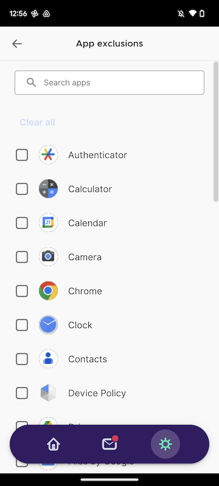
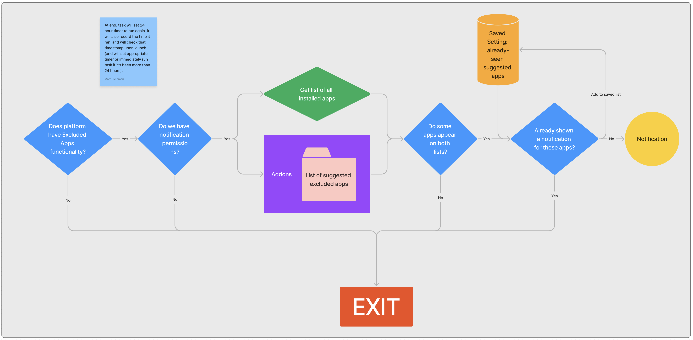
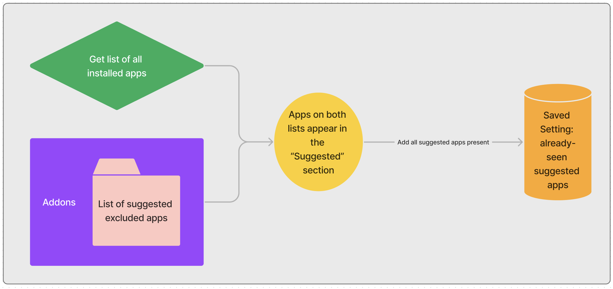

Suggesting Apps for Split Tunneling
===================================

Epic: [VPN-4412: Suggest Apps to Exclude from VPN Protection](https://mozilla-hub.atlassian.net/browse/VPN-4412)

Context / Problem Statement
---------------------------

We're looking to create tools that prompt the user in ways that help them stay more secure. Split tunneling (called 'App Exclusion' to users) is a feature that can reduce the need to turn off the VPN entirely by excluding traffic in specific apps from the VPN tunnel, but many users don't know about it. The current feature is in settings, and provides an alphabetical checklist of installed apps:



This epic is for a new feature to proactively let users know when they have apps that could benefit from the split tunneling feature. We want this to be a notification outside the app, to engage users who rely on Mozilla VPN but rarely open the app.

Assumptions & Out-of-scope
--------------------------

-   This is only for platforms that currently support split tunnel - Windows, Linux, and Android. We will not build split tunneling into macOS or iOS as part of this work.
-   Notifications refer to system-level notifications. There are no additions to the messages tab considered in this tech spec.

Open Questions
--------------

-   What do we use to canonically track apps we may want to exclude? Is there a bundle ID? The name of app (fragile)? Something else? Do we use different IDs across platforms?
-   Any easy ways to categorize games? (See [VPN-4433](https://mozilla-hub.atlassian.net/browse/VPN-4433).)
-   How will we decide which apps are initially on the suggested list?
-   Does the suggested list just include specific apps, or can it include entire directories (like well-known Windows game directories) and/or allow wildcard matching?
-   What is the process for adding an app to list, in light of potential security/privacy concerns when adding malicious apps?

Implementation (estimated 36-57 points total)
---------------------------------------------------

This work is broken into four sections, with the bulk of code coming in the middle two sections. Those two sections should each be built behind their own separate feature flag, though we'd expose both parts together via Nimbus.

### Prerequisites (15-26 points total)

-   (3-5 points) Answer the open questions above
-   (5-8 points) Create a well-structured file (for our own research, as well as one users can add to via GitHub pull requests on the client repo) w/ apps to exclude (and update the README in the repo to explain this new type of contribution). These docs will live in our repo, and be bundled with the app. Add tests to ensure the doc's format integrity is maintained. This format should be designed to allow new platforms (like websites) to be added without breaking anything.
    - The document format will be a single JSON file for all platforms. Within each platform there will be an array of IDs for the suggested apps. These will each be an array, and we'll only look at the first item in the array - if a second string exists in the array will be considered comments (as JSON doesn't have the concept of comments). (This is preferred to keys/values for binary/comments compactness/legibility.)
    ```
    {
        "android":
            [
                ["my.app.identifier", "an optional comment"],
                ["my.other.app.identifier"]
            ],
        "linux":
            [
                ["whatever.identifier.linux.uses", "comments are still optional"]
            ]
    }
```
    -   Additions to the list should be given the same amount of thought that adding new dependencies to our repo are given. That is, full research by our engineers to ensure nothing malicious is being brought in. And erring on the side of not including any.
        -   This statement (or something similar) should be added to the top of the file in a comment.
    -   From Santiago: <https://github.com/citizenlab/test-lists/tree/master/lists>, <https://ooni.org/>
    -   Santiago list for Android: <https://docs.google.com/spreadsheets/d/1j2REPQkcdPg5bNW5B3T-L8dnlNPPwAms1WlBiYvVwoc/edit#gid=0>
-   (5-8 points) Deep linking into app for notification to work ([VPN-5034](https://mozilla-hub.atlassian.net/browse/VPN-5034)): This may be even fewer points, based on the scope (in ticket).
-   (2-5 points) Create initial list of recommended app exclusions

### Create daily task in app (11-15 points total)


-   (3-5 points) Daily task at noon (local) to check for suggested apps that are installed on the device (after one week from first install), halt task if don't have notification permissions or if the platform doesn't have app exclusions feature.
    -   This will be run by the app for desktop, and in the daemon on Android. (iOS does not have split tunnel.)
        -   After running the job, we will create timer for noon the following day to run the job next. Additionally, we'll record the time for this job as a setting, and we'll check this timestamp on app/daemon launch - if the deadline has passed we'll immediately run the task.
        -   We're not concerned if the user's clock shifts. The vast majority of these daily checks will not result in any notification to the user (except in the rare case that the user consistently adds new apps daily that happen to be on the suggested list). The worst case scenario would be that a user gets two notifications in a 24 hour period. This isn't the planned user interaction, but given the low likelihood (neither clock changes nor the installation of new suggested apps is a common event) it's not worth building a system that considers this.
-   (3-5 points) Is there one or more new apps?
    -   Check against setting - if we have ever sent a notification for this app before, don't send one (this should be done off the app's domain name or something, not marketing name - that can change)
    -   Pop an OS-level notification (on Android, use a suggestion channel). The text is intentionally generic, and makes sense if there is one new app or multiple.
    -   Add new app(s) to "have sent notification" list
-   (1 point) Add this notification type to the settings screen that allows per-type opt out (App permissions -> Notifications)
-   (2 points) Ensure tapping notification leads to correct screen
-   (2 points) Add 3 dev menu options:
    - Pull a new suggested apps list immediately
    - Clear the "have sent notification" list.
    - Immediately run the daily check job.

### Improve existing split tunnel screen (10-16 points total)
[Figma mocks](https://www.figma.com/file/UZYzma7hlcfE5ke3z8jGbN/App-exclusions-suggestions?type=design&node-id=196-6366&mode=design&t=RL1hdfBQLMS1rKVa-0)



-   (2 points) Run the task on the launch of screen
    -   Update the "have seen these apps" settings list with all suggested apps. (If a new suggested app is install and the Settings screen is opened by a user before the daily job runs to send a notification, we thus never send a notification. This behavior was confirmed by Santiago.)
-   (1-2 points) Add recommended section (only if 1 or more apps on the system are suggested). Since we've just updated the settings list of recommended apps on the system (in prior bullet point), use this settings list - if any system app we discover also appears on that list, it goes in the recommended section.
-   (1 point) Sort recommended section - selected ones at top alphabetically, then the reset alphabetically
-   (1 point) Sort "others" section - selected ones at top alphabetically, then the reset alphabetically
-   (1-2 points) Update sort when something is checked or unchecked. The list dynamically updates when a user is on it.
-   (1-2 points) Ensure search works, shows one section, is alphabetically sorted
-   (2-5 points) Ensure accessibility is up to date
-   (1 point) Add metrics for how many suggested (and non-suggested) apps are excluded

### Day 2

These are important components that we are committed to delivering, but are outside the scope of this epic. They are items that will be done as soon as the epic is closed, but do not block the feature on shipping.

-   Engineering metrics
    -   Metrics will be created for a successful deep linking, as well as an erroneous deep linking (the app cannot figure out how to resolve the deep link).
    -   Add performance metrics around load time of the Excluded Apps screen.
    -   Create a metric for when the daily job was successful, and another one for when it fails.
    -   A metric should be recorded when the notification is sent

Other options considered
------------------------

Design and research went through several iterations, so the [designs](https://www.figma.com/file/UZYzma7hlcfE5ke3z8jGbN/App-exclusions-suggestions?type=design&node-id=196-6366&mode=design&t=RL1hdfBQLMS1rKVa-0) were set before this tech spec was written. (See [completed tickets in the epic](https://mozilla-hub.atlassian.net/browse/VPN-4412) for more background.)

Other options considered included dynamically serving the suggested lists from addons or our repo or Guardian, each of which added complexity for hosting/validating. With the rarity of the list being updated (and lack of time-sensitivity when it does), this draft bundles the lists with the app. Hosting the list in Guardian was difficult (which is a private repo, so the list would need to be hosted elsewhere to allow public suggestions).

### Other options considered for suggested app files

The goals for the file format:
-   Easy to read by humans
-   Easy for humans to add to, no matter their level of technical proficiency
-   Easy for us to parse in the app
-   Allowing comments in the file. While we still could structure a text file to allow comments, this became less important when the plan became "one file per platform, one app per line".

Initially, there was one additional goal (no longer consideration):
-   To have one file for all platforms, so that we'd remember to add a specific app to all platforms at once. With a conversation around potentially wanting different suggested app categories on mobile, this seems unimportant.

Other options considered included CSV, YAML, and plain text files. While YAML could be useful (as it's easy for less-technical people to read), we don't have a good YAML parser in the app yet. We could add a library, of course. However, we'd need to write our own document format test, because the YAML file (or CSV) would need to be structured in a specific way. 

Ultimately, JSON version seemed simpler (and thus easier to build) - there aren't the same parsing concerns and it's easy for contributors.

Metrics
-------

We will create several metrics as part of this work; they are described in the appropriate spots in the "Implementation" section.

We'd expect the `apps_excluded` metric to increase after this is implemented on platforms which have app exclusions. Both the number of people with more than 0 apps excluded and the average count of apps excluded should increase.

If Nimbus is available by the time this feature is complete, we will use it to roll out the test.

Security / Privacy
------------------

Since all the work is being done on device, the only security concerns are ensuring we don't log any private info.

The excluded apps list will likely live in the client repo. There are ways to weaponize the suggested apps list to weaken privacy of key apps, but for this attack vector to be used a Mozilla staffer would need to approve the PR with the bad-faith addition to the suggested app list.

Considerations for roll out
----------------------

While the reworked app exclusion page will affect all platforms that support split tunneling, notifications will only be shown to users who have already allowed our app to send them. On mobile, we show the "approve notifications" screen immediately upon launching the app for the first time, which likely depresses approval rates. We may want to re-consider how we show this as part of onboarding.

Test Plan
---------

-   Fresh install of the app on a device that has a suggested app. Ensure that app is shown appropriately on the screen in VPN Settings. Ensure a notification suggesting its exclusion is popped at an appropriate time.
-   Install an app on the suggested list on the device. Ensure the app is now shown appropriately on the screen in VPN settings. Ensure a notification suggesting its exclusion is popped at an appropriate time.
-   Add an app on the device to the list on the repo, wait, and ensure it is offered as an app to exclude within 24 hours. (Alternatively, use the dev menu option to immediately run the daily job.)
-   Delete an app on the list from the device, ensure it is no longer shown on the screen in VPN settings.
-   Test on all devices with split tunneling, to ensure the app list works on all platforms
