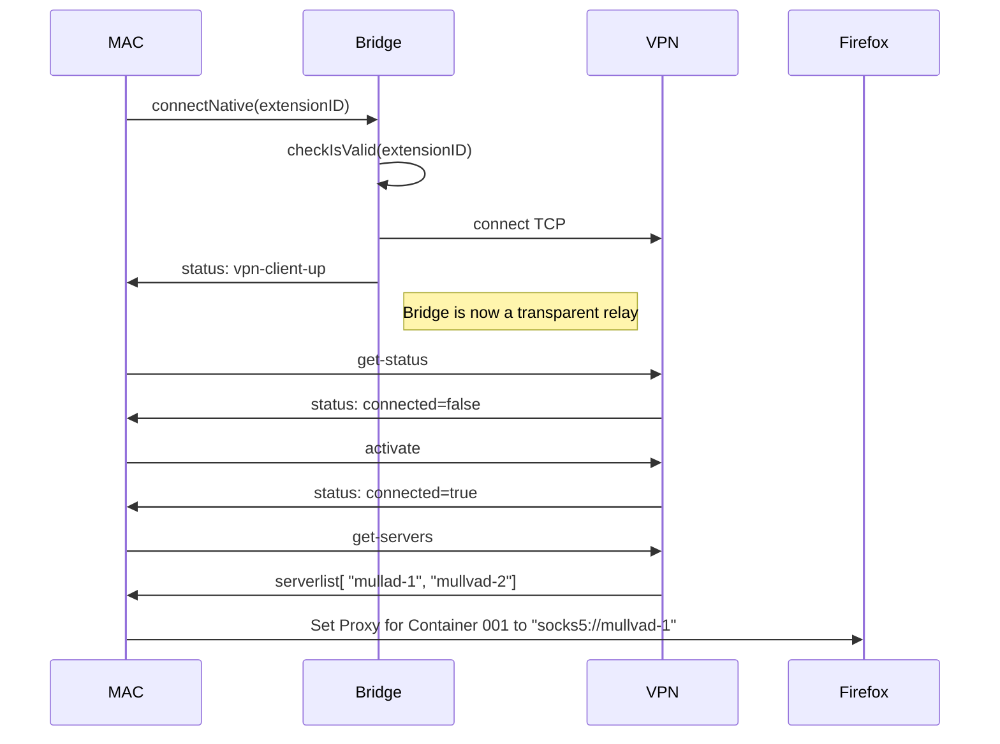

- Status: Draft
- Date: 2023-05-29
- Authors:
    - [@strseb](https://github.com/strseb)
    - [@lesleyjanenorton](https://github.com/lesleyjanenorton)
    - [@oskirby](https://github.com/oskirby)
- RFC PR: -
- Implementation GitHub issue: -
- [Design @Figma](https://www.figma.com/file/s13B7zs27cadZXUyvxobgW/Better-Together-Explorations?type=design&node-id=259-4830&mode=design&t=4BmtgXMzjnubd9gc-0)

-----
# Firefox + VPN Better together
## Problem Statement


 

VPNs currently allow you to select a City through which you want your traffic to emerge to the Internet and users use this to express a variety of geolocation preferences. These controls are not flexible enough - users can only select a single location through which all traffic should go through. 

Therefore we want to propose a new Web-Extension that extends on top of the VPN+MAC API, giving users the options to:
- Enable the VPN only on Firefox 
 - Disable the VPN only on Firefox 
 - Exclude a Firefox tab from VPN protection  
 - Specify an Exit Location a Page.

We already have integrated into Firefox with [Multi Account Containers](https://github.com/mozilla/multi-account-containers) which allows users to specify an exit location for a container. 
The following parts expect knowledge on how the MAC Extension works, for a refresher scroll to appendix :) 

----

## Preconditions
As we currently not plan to be a bundled feature into Firefox the first MVP, Users need to have the VPN Client installed, 
be logged in with a subscription. During an ✨ Onboarding Flow ✨ (currently unspecified) users installed 
the VPN-Integration Extension into their Firefox Profile. 

## Delivery
As the Extension will be Mozilla signed, asking Firefox to open a URL pointing to our XPI will prompt the install, without warnings. 
The onboarding will be refined based on foxfooding feedback. 


## VPN API 


### Networking
Using the [proxy api](https://developer.mozilla.org/en-US/docs/Mozilla/Add-ons/WebExtensions/API/proxy) a network extension can decide which proxy each network request should use. So from a network request perspective, there are only 4 possible cases to implement:

| StateNr               | Device VPN is On | Device VPN is OFF |
|-----------------|------------------|-------------------|
| Page VPN is On  | 1                | 2                 |
| Page VPN is Off | 3                | 4                 |

In the following sections, we will explain what changes we need inside the client to support each of the cases and where the extension must proxy traffic to. 


#### State 1: Device VPN is On & Page VPN is On
In this state the extension can simply set the proxy for those network requests to `null` to use the user's active server.  
If a custom exit location is set it must set it to the `socks5` proxy of that endpoint. No changes are needed on the client as this is how MAC uses the current API.


#### State 2: Device VPN is OFF & Page VPN is On

Simplified, the VPN has the following states:
```cpp
  enum State {
    StateOff, // Nothing protected
    StateOn, // Whole device protected
    (...) // unrelated intermediate states
  };
```
An extension can send an `ExtensionMessage<activate>` to the VPN to turn on whole-device protection. 
For this case, we propose to introduce a new state `StateOnPartial` that will be activated on a call of an extension to `ExtensionMessage<activate>` instead. It is similar to `StateOn` with the following properties: 
- The `allowedIPAddressRanges` for this activation is set to `10.124.0.0/20` so that only the Mullvad Exit Proxies are accessible on the VPN Network Device. Therefore, all other traffic will not use the VPN. 
- A Mullvad DNS server will be set, so that the Mullvad proxies are resolvable. If a custom DNS is set, we need to set a Mullvad DNS as 2nd DNS server.
- The Client UI does not show an activation. (or a new special UI state)
> Q: Do we need a new UI state ? or like a "firefox is using the vpn?" 
- If the Client activates, it will attempt to switch to `StateOn` and protect the whole device.
- An Extension may request `ExtensionMessage<deactivate>` only if the client is in `StateOnPartial` and it was the activator. The Client will then go to `StateOff`.

The extension must then set the proxy to the `socks5` URL of the current `exitServer` OR, if a custom exit location is set, to the `socks5` proxy of that endpoint.

#### State 3: Device VPN is On & Page VPN is Off

If the full device is protected and the VPN integration is enabled, we will utilize a Socks5 Proxy running on localhost that will make sure its outgoing traffic utilizes the non-vpn default route. 

For that, we will create an external binary that:
- opens a socks5 proxy locally on a random port
- generates a username and password for this session
- prints the port, username, password to STDOUT so that the parent process may gather that info. 

The VPN client will then pass that info to the Extension inside it's `status` response as an extra field. The extension must use that proxy for pages wanting to bypass the VPN.

For Platforms where split tunneling is supported, the proxy is permanently fixed in the split-tunnel rule list, making sure the vpn connection cannot be used. 

For Platforms where split tunneling is not available, the proxy will use socket options to make sure the right network device is used.
> Q: do we need more details here? 

If the daemon has support for per-app firewall rules (currently Windows), we will make sure only Firefox may access the port of the proxy to make sure other local apps cannot use the proxy to get the real IP of the user. 


#### State 4: Device VPN is OFF & Page VPN is Off
This State is trivial, no proxy needs to be set by the extension. 

### Other API Changes 

#### Renaming
We will rename the current C++ Extension API classes to ... ExtensionAPI. They are currently under `server/` and called `ServerHandler` && `ServerConnection` which is an overloaded term for a VPN. 

#### Split-Tunnel Lists
Instead of reporting all excluded apps in `disabled_apps`, we will limit the response to executables containing `firefox`. The Extension may then limit it's funcitonality until resolved, as Firefox cannot access the VPN if it is excluded.  


## Appendix 


### Refresher MAC+VPN
MAC allows users to associate websites with containers. The VPN integration allows selecting a location from the VPN server list as the exit location for each container. It Requires Mozilla VPN to be installed and active to work. 
It is only supported on Desktop plattforms, as NativeMessaging is not available on Mobile. 


For the MAC + VPN we have three actors: 
- MAC - [Multi Account Containers](https://github.com/mozilla/multi-account-containers) the Plugin opens a [Native Messaging port](https://developer.mozilla.org/en-US/docs/Mozilla/Add-ons/WebExtensions/Native_messaging) using `browser.runtime.connectNative("mozillavpn");`
- NativeMessaging.rs (Bridge) - Is the Process sitting on the other side of ""? "STDIN" and "STDOUT" are connected to the Extension. After validating that the Port is related to an Extension that may access the client, it will establish a tcp connection and act as a transparent message bridge.
- Client: The VPN Client. On Desktop, it creates a [TCP Server](https://github.com/mozilla-mobile/mozilla-vpn-client/blob/9e74f31118ce23b92a0d1d14b8e928f3cd7114ab/src/server/serverhandler.cpp#L25)



### Current Message format 
```ts
// Over the Wire we send a Raw Buffer
type NMRequest = Buffer;
// The first byte is the Body Length
type NMRequestLength = NMRequest[0];
// The Body contains a UTF-8 encoded JSON blob
// That must parse into <ExtensionMessage>
type NMRequestBody = NMRequest[1:NMRequestLength];


interface ExtensionMessage{
    // Every request must have a type.
    // The response obj with have the type of the request or "invalidRequest"
    t:ExtensionMessageType 
}

type ExtensionMessageType = "activate" | "servers" | "disabled_apps" | "status" |"invalidRequest"
```


