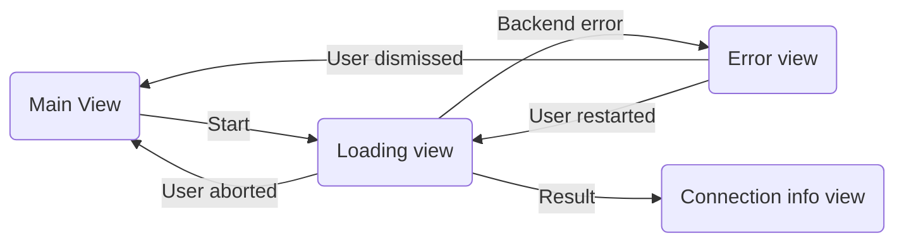

# VPN Speed test

The VPN speed test gives users information on their current network connection. The test can be run only when the VPN is activated and the connection is healthy. Results of the connection test are shown on the **Connection Info Screen**.

## Benchmarks

There are three benchmarks that are `Task`s and are being run sequentially.

### Benchmark: Ping

The value for `ping` is determined by listening to changes of ping latency using the `ConnectionHealth` class for a certain duration and calculating the average of all sent and received pings.

### Benchmark: Download

The value for download is determined by downloading data from a remote file server and calculating the amount of data that is being received while running the download.

### Benchmark: Upload

The value for upload is determined by posting data to a remote server.

## Result

Depending on the results of the benchmarks we set a connection `Speed` to indicate what the current connection is capable of.

* `SpeedSlow`: Connection speed is slow and should be potentially troubleshooted.
    * Switching server locations
    * Checking your internet connection
* `SpeedMedium`: Connection speed is good enough for basic internet usage.
    * Browsing the internet
    * Streaming video
    * Video conferencing
* `SpeedFast`: Connection speed is capable of handling usage that requires more bandwidth.
    * Streaming in 4K
    * High-speed downloads
    * Online gaming

## States

- `StateInitial`: Benchmarking did not start or was stopped without any errors.
- `StateRunning`: The current connection is being benchmarked.
- `StateReady`: All benchmarks were run successfully and the results are available.
- `StateError`: While benchmarking an unexpected error occurred.

## User flow

